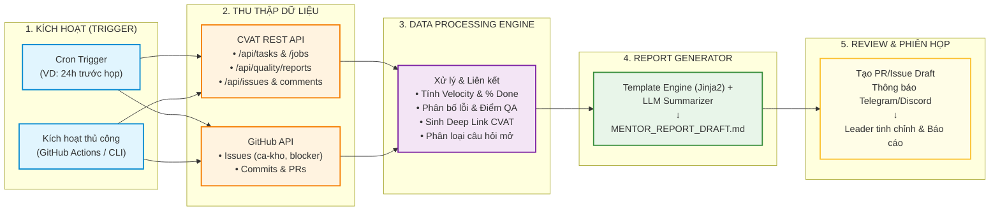
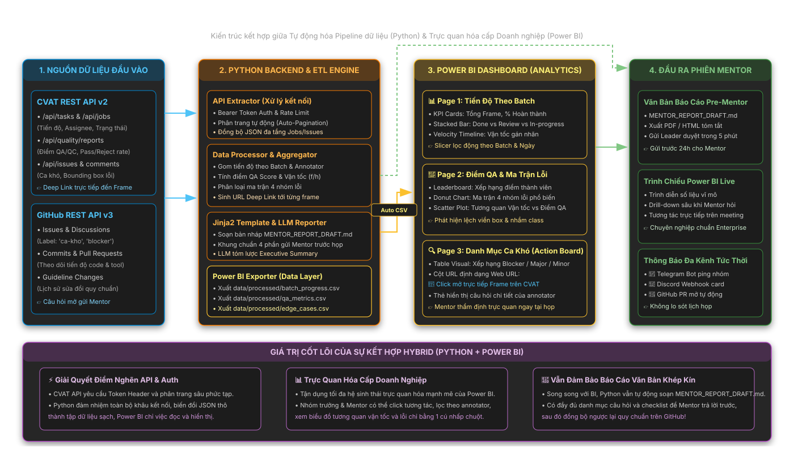

# 🚀 auto-annotation-reporter

### 📊 Pipeline Tự Động Hóa Báo Cáo Gán Nhãn Dữ Liệu (CVAT & GitHub Sync)

[](https://www.python.org/)
[](https://www.cvat.ai/)
[](https://docs.github.com/en/rest)
[](docs/01-architecture/HYBRID_POWERBI_ARCHITECTURE.md)
[](https://opensource.org/licenses/MIT)
[](docs/04-devops-automation/SCHEDULED_WORKFLOW_GUIDE.md)

> **Hệ sinh thái tự động hóa tổng hợp báo cáo tiến độ & chất lượng gán nhãn dữ liệu (Data Annotation Operations) từ CVAT và GitHub. Ứng dụng mô hình Hybrid kết hợp Python ETL Engine, Dashboard Power BI trực quan và luồng kích hoạt theo lịch định kỳ phục vụ các phiên Mentor & Leader.**


---

## 📌 1. Bối cảnh & Vấn đề giải quyết

Trong các dự án thị giác máy tính (Computer Vision) và gán nhãn dữ liệu quy mô lớn (Data Annotation Operations):
* **Phân mảnh dữ liệu**: Tiến độ gán nhãn nằm trên nền tảng gán nhãn (**CVAT**), trong khi thảo luận kỹ thuật, mã nguồn, báo lỗi và phân chia công việc lại nằm trên **GitHub** (Issues, PRs).
* **Tốn thời gian chuẩn bị họp**: Hàng tuần/hàng kỳ trước buổi họp với Leader hoặc Mentor, nhóm trưởng thường mất **2 đến 4 giờ** để tổng hợp số liệu thủ công: đếm số frame hoàn thành, tính tỷ lệ lỗi, tổng hợp các ca khó (edge cases), và lọc các câu hỏi chưa được giải đáp.
* **Bỏ sót ca khó (Blind Spots)**: Các frame gán nhãn gây tranh cãi hoặc bị gắn cờ lỗi thường bị trôi trên CVAT nếu không được liên kết trực tiếp bằng Deep Link vào tài liệu báo cáo.
* **Thiếu tính định lượng**: Khó đo lường chính xác vận tốc gán nhãn (*velocity*) theo từng thành viên và phân bố loại lỗi (*box lệch, sai nhãn, thiếu đối tượng*).

👉 **Giải pháp**: Xây dựng **Pipeline tự động hóa khép kín (End-to-End Automated Pipeline)**, định kỳ thu thập dữ liệu qua API từ CVAT & GitHub, tổng hợp chỉ số, trích xuất ca khó kèm Deep Link trực tiếp đến từng frame/job, và tạo bản thảo báo cáo chuẩn xác 4 phần cho Leader/Mentor.

---

## 🏗️ 2. Kiến trúc hệ thống (System Architecture)



Hệ thống hoạt động theo quy trình 5 giai đoạn khép kín:



### 🏛️ Mô Hình Hybrid: Python ETL Engine & Power BI Analytics Dashboard


> 💡 *Chi tiết hợp đồng dữ liệu 3 bảng CSV và thiết kế giao diện Power BI: Xem [docs/HYBRID_POWERBI_ARCHITECTURE.md](docs/HYBRID_POWERBI_ARCHITECTURE.md)*

### ⏰ Luồng Hoạt Động Tự Động Hóa Theo Lịch (Scheduled Dispatcher)


> 💡 *Chi tiết cấu hình GitHub Actions Cron và Secrets: Xem [docs/SCHEDULED_WORKFLOW_GUIDE.md](docs/SCHEDULED_WORKFLOW_GUIDE.md)*

---


## ⚡ 3. Chi tiết 5 Giai đoạn cốt lõi

### Giai đoạn 1: Kích hoạt (Trigger)
* **Cron Trigger**: Thiết lập chạy tự động theo lịch (ví dụ: `0 8 * * 1` - sáng thứ Hai hoặc 24 giờ trước phiên họp Mentor).
* **Manual / Event Trigger**: Cho phép chạy thủ công từ terminal qua CLI hoặc chạy trên giao diện web GitHub Actions (Workflow Dispatch) bất cứ khi nào cần báo cáo khẩn.

### Giai đoạn 2: Thu thập dữ liệu (Data Extraction)
* **CVAT REST API v2**:
  * Trích xuất thông tin Task, Job, phân công (`assignee`) và trạng thái (`annotation`, `validation`, `completed`).
  * Trích xuất báo cáo chất lượng QA/QC: Độ chính xác, tỷ lệ Accept/Reject, các lỗi do reviewer ghi nhận.
  * Thu thập danh sách Issues/Comments gắn tại từng frame hình hoặc object.
* **GitHub API (REST/GraphQL)**:
  * Quét các Issue mở có gắn nhãn: `ca-kho`, `mentor-question`, `blocker`.
  * Thống kê Commit, Pull Request để cập nhật tiến độ phần mềm, pipeline dữ liệu phụ trợ.

### Giai đoạn 3: Động cơ Xử lý & Liên kết (Data Processing Engine)
* **Tiến độ & Vận tốc**: Tính toán tỷ lệ phần trăm hoàn thành, số frame tồn đọng (*backlog*), vận tốc gán nhãn trung bình theo từng thành viên.
* **Phân tích lỗi**: Thống kê ma trận lỗi (*Bounding box lệch/lỏng, gán sai class, bỏ sót nhãn, sai thuộc tính*).
* **Trình tạo Deep Link**: Tự động cấu trúc URL trỏ trực tiếp đến chính xác frame hình đang có tranh chấp trên CVAT (`https://<cvat-host>/tasks/{id}/jobs/{job_id}?frame={idx}`).
* **Phân loại câu hỏi**: Gom nhóm câu hỏi kỹ thuật về quy chuẩn gán nhãn (guideline) hoặc hạ tầng.

### Giai đoạn 4: Sinh bản thảo báo cáo (Report Generator)
* Sử dụng **Jinja2 Template** kết hợp mô hình ngôn ngữ (LLM - Gemini / GPT / Claude) để tóm lược ngắn gọn số liệu thành tài liệu Markdown: `MENTOR_REPORT_DRAFT.md`.
* **Cấu trúc 4 phần chuẩn mực**:
  1. **Tiến độ Batch & KPI**: Tổng frame, % đạt được, vận tốc từng người, tiến độ so với kế hoạch.
  2. **Chất lượng & Điểm QA/QC**: Tỷ lệ Pass/Reject, phân loại lỗi phổ biến, điểm chất lượng trung bình.
  3. **Danh sách Ca khó (Edge Cases)**: Bảng chi tiết kèm hình ảnh, mô tả vấn đề và **Deep Link CVAT trỏ thẳng frame**.
  4. **Câu hỏi mở & Vấn đề cần Mentor gỡ rối**: Các trường hợp guideline chưa bao quát, xung đột nhãn cần Mentor định đoạt.

### Giai đoạn 5: Review & Phiên họp Mentor
* Tự động tạo **Draft Pull Request** hoặc **GitHub Issue** chứa nội dung báo cáo.
* Gửi Webhook thông báo tới **Telegram / Discord / Slack** của Leader.
* Nhóm trưởng review, tinh chỉnh nhanh 5-10 phút trước khi xuất báo cáo gửi Mentor.

---

## 📁 4. Cấu trúc thư mục dự án

```text
├── .github/
│   └── workflows/
│       └── mentor_report_automation.yml  # Lịch chạy định kỳ & Manual trigger
├── assets/
│   └── mermaid-diagram.svg              # Sơ đồ kiến trúc trực quan
├── docs/                                # Thư mục tài liệu chi tiết của dự án
│   ├── ARCHITECTURE.md                  # Tài liệu đặc tả kiến trúc kỹ thuật & Data Flow
│   ├── REPORT_TEMPLATE_SPEC.md          # Chuẩn đặc tả cấu trúc bản báo cáo 4 mục
│   ├── CVAT_INTEGRATION_GUIDE.md        # Hướng dẫn kết nối CVAT REST API & Deep Links
│   ├── GITHUB_INTEGRATION_GUIDE.md      # Hướng dẫn tích hợp GitHub Issues & Actions
│   ├── DEPLOYMENT_AND_WORKFLOW.md       # Hướng dẫn triển khai CI/CD & Bot thông báo
│   └── MENTOR_REPORT_DRAFT_SAMPLE.md    # Báo cáo mẫu minh họa thực tế
├── src/                                 # Mã nguồn Python của hệ thống
│   ├── extractors/                      # Trích xuất dữ liệu từ CVAT và GitHub
│   ├── processors/                      # Tính toán KPI, phân tích QA, sinh Deep Link
│   ├── generators/                      # Render Markdown qua Template & LLM
│   ├── notifiers/                       # Gửi thông báo Telegram/Discord/Slack
│   └── main.py                          # CLI entrypoint điều phối pipeline
├── templates/
│   └── mentor_report_template.j2        # Template Jinja2 cho bản báo cáo
├── .env.example                         # Cấu hình biến môi trường mẫu
├── .gitignore
├── requirements.txt                     # Thư viện phụ thuộc Python
└── README.md                            # Hướng dẫn dự án
```

---

## 🚀 5. Hướng dẫn cài đặt & Chạy thử nghiệm

### 5.1. Yêu cầu môi trường
* Python 3.10 trở lên
* Tài khoản CVAT với Personal Access Token (PAT) hoặc Basic Auth
* GitHub Personal Access Token (với quyền `repo`)

### 5.2. Cài đặt các thư viện

```bash
# Clone repository
git clone https://github.com/nolanminhdinh/auto-annotation-reporter.git
cd auto-annotation-reporter

# Tạo môi trường ảo
python -m venv .venv

# Kích hoạt môi trường (Windows PowerShell)
.\.venv\Scripts\Activate.ps1
# Hoặc trên Linux/macOS:
# source .venv/bin/activate

# Cài đặt thư viện phụ thuộc
pip install -r requirements.txt
```

### 5.3. Cấu hình biến môi trường (`.env`)

Tạo file `.env` từ file mẫu:
```bash
cp .env.example .env
```

Điền các thông số xác thực:
```ini
# CVAT Configuration
CVAT_HOST=https://cvat.example.org
CVAT_USER=your_username
CVAT_PASS=your_password
# hoặc dùng Token:
CVAT_TOKEN=your_cvat_personal_access_token
CVAT_TASK_ID=217

# GitHub Configuration
GITHUB_TOKEN=your_github_token
GITHUB_REPO=your_org/your_repo

# Notifier (Tùy chọn)
TELEGRAM_BOT_TOKEN=your_telegram_bot_token
TELEGRAM_CHAT_ID=your_chat_id
```

### 5.4. Chạy sinh báo cáo qua CLI

```bash
# Chạy tạo báo cáo cho 1 Task cụ thể
python src/main.py --task-id 217 --output reports/MENTOR_REPORT_DRAFT.md

# Chạy kèm thông báo Telegram
python src/main.py --task-id 217 --notify telegram
```

File báo cáo sau khi sinh sẽ nằm tại `reports/MENTOR_REPORT_DRAFT.md` sẵn sàng để Leader duyệt và gửi Mentor.

---

## 📚 6. Bản Đồ Tài Liệu & Hướng Dẫn Điều Hướng (Documentation Hub)

Để giúp các thành viên trong nhóm, Mentor hoặc bất kỳ ai chưa từng tham gia dự án có thể nhanh chóng nắm bắt và tra cứu đúng tài liệu cần thiết, toàn bộ tài liệu được phân chia thành **5 nhóm chuyên biệt trong [`docs/`](docs/)** và **Hệ thống báo cáo tuần trong [`reports/weekly/`](reports/weekly/)**:

> 🧭 **Cẩm nang tổng quan**: Xem hướng dẫn tra cứu nhanh tại [`docs/README.md`](docs/README.md).

```text
📁 docs/
├── 🏛️ 01-architecture/         <-- Kiến trúc hệ thống, Mô hình Hybrid & 4 Workflows
├── 📊 02-data-and-analytics/   <-- Data Dictionary, Data Model, DAX Measures & Mẫu báo cáo
├── 🔌 03-integrations/         <-- Hướng dẫn tích hợp CVAT REST API v2 & GitHub API v3
├── ⚙️ 04-devops-automation/    <-- Cấu hình GitHub Actions Cron & Bot thông báo
├── 👥 05-project-management/   <-- Kế hoạch quản lý WBS, RACI 5 thành viên & Tiêu chí nghiệm thu
└── 📁 assets/                  <-- Sơ đồ kiến trúc Mermaid & SVG vector

📁 reports/weekly/
├── 📄 README.md                <-- Quy chuẩn báo cáo tuần
└── 📁 week-01/                 <-- Báo cáo Tuần 1: Timeline 5 thành viên, Đã làm, Chưa làm & Cải tiến
```

---

### 🏛️ Nhóm 1: Kiến Trúc & Thiết Kế Hệ Thống (`docs/01-architecture/`)
*Mục tiêu: Dành cho Tech Lead / Architect muốn hiểu bản chất kỹ thuật và nguyên lý dòng chảy dữ liệu.*
* [**`SYSTEM_ARCHITECTURE.md`**](docs/01-architecture/SYSTEM_ARCHITECTURE.md): Đặc tả chi tiết kiến trúc khép kín 5 giai đoạn (*Trigger $\to$ Extract $\to$ Process $\to$ Report $\to$ Review*).
* [**`HYBRID_POWERBI_ARCHITECTURE.md`**](docs/01-architecture/HYBRID_POWERBI_ARCHITECTURE.md): Luồng dữ liệu mô hình Hybrid kết hợp Python ETL Engine với Power BI Analytics Dashboard.
* [**`WORKFLOWS.md`**](docs/01-architecture/WORKFLOWS.md): Tổng hợp 4 biểu đồ hoạt động Mermaid (Vòng lặp khép kín, Mô hình Hybrid, Luồng tự động theo lịch).

---

### 📊 Nhóm 2: Nghiệp Vụ Dữ Liệu & Bộ Chỉ Số Báo Cáo (`docs/02-data-and-analytics/`)
*Mục tiêu: Dành cho Data Analyst, BI Developer, Mentor thẩm định công thức, mô hình dữ liệu và giao diện Power BI.*
* [**`PROJECT_ANALYTICS_SPEC.md`**](docs/02-data-and-analytics/PROJECT_ANALYTICS_SPEC.md): **Tài liệu đặc tả cốt lõi** gồm Mindmap nghiệp vụ, Data Model Star Schema, Data Dictionary 9 bảng, 20 Measures DAX, logic phân khúc nhân sự và đặc tả chi tiết 5 trang Power BI.
* [**`REPORT_TEMPLATE_SPEC.md`**](docs/02-data-and-analytics/REPORT_TEMPLATE_SPEC.md): Quy chuẩn cấu trúc bản báo cáo văn bản tóm tắt 4 phần gửi Mentor trước buổi họp.
* [**`MENTOR_REPORT_SAMPLE.md`**](docs/02-data-and-analytics/MENTOR_REPORT_SAMPLE.md): Bản báo cáo mẫu thực tế được tự động sinh ra từ pipeline.

---

### 🔌 Nhóm 3: Tích Hợp API & Thu Thập Dữ Liệu (`docs/03-integrations/`)
*Mục tiêu: Dành cho Backend / Data Engineers (Tú & Duy) phụ trách kết nối dữ liệu từ CVAT và GitHub.*
* [**`CVAT_INTEGRATION_GUIDE.md`**](docs/03-integrations/CVAT_INTEGRATION_GUIDE.md): Hướng dẫn xác thực PAT Token, danh mục endpoint `/api/tasks`, `/api/jobs`, `/api/quality/reports` và quy tắc sinh URL Deep Link trực tiếp đến từng frame.
* [**`GITHUB_INTEGRATION_GUIDE.md`**](docs/03-integrations/GITHUB_INTEGRATION_GUIDE.md): Hướng dẫn tích hợp GitHub REST API trích xuất danh sách ca khó (label `ca-kho`, `blocker`) và tự động tạo Pull Request Draft.

---

### ⚙️ Nhóm 4: Tự Động Hóa, CI/CD & Vận Hành (`docs/04-devops-automation/`)
*Mục tiêu: Dành cho DevOps Engineers (Ngọc) hoặc người vận hành hệ thống trên server/cloud.*
* [**`DEPLOYMENT_AND_WORKFLOW.md`**](docs/04-devops-automation/DEPLOYMENT_AND_WORKFLOW.md): Cẩm nang cài đặt môi trường, biến cấu hình `.env`, chạy lệnh CLI và thiết lập webhook thông báo.
* [**`SCHEDULED_WORKFLOW_GUIDE.md`**](docs/04-devops-automation/SCHEDULED_WORKFLOW_GUIDE.md): Chi tiết cấu hình GitHub Actions Cron Trigger, khai báo GitHub Secrets và kiểm thử luồng chạy tự động.

---

### 👥 Nhóm 5: Quản Trị Dự Án & Kế Hoạch Thực Hiện (`docs/05-project-management/`)
*Mục tiêu: Dành cho Project Lead (Minh) điều phối và các thành viên nắm rõ nhiệm vụ, deadline và tiêu chuẩn nghiệm thu.*
* [**`PROJECT_MANAGEMENT_PLAN.md`**](docs/05-project-management/PROJECT_MANAGEMENT_PLAN.md): Cơ cấu nhóm 5 người, bảng phân công nhiệm vụ chi tiết (WBS), ma trận trách nhiệm RACI, quy tắc Git Flow, Hợp đồng bàn giao dữ liệu và tiêu chí nghiệm thu của Lead.

---

### 📈 Nhóm 6: Hồ Sơ Báo Cáo Tiến Độ Tuần (`reports/weekly/`)
*Mục tiêu: Minh bạch hóa tiến độ từng tuần, giúp Mentor và các bên liên quan theo dõi sức khỏe dự án.*
* [**`reports/weekly/README.md`**](reports/weekly/README.md): Quy chuẩn báo cáo tuần.
* [**`reports/weekly/week-01/`**](reports/weekly/week-01/):
  * ⏱️ [`TIMELINE_CONG_VIEC.md`](reports/weekly/week-01/TIMELINE_CONG_VIEC.md): Timeline chi tiết từng ngày của 5 thành viên trong tuần 1.
  * 📊 [`BAO_CAO_TUAN_01.md`](reports/weekly/week-01/BAO_CAO_TUAN_01.md): Báo cáo công việc đã hoàn thành, việc chưa xong & 3 cải tiến sản phẩm quan trọng kèm căn cứ kỹ thuật.

---

## 👥 7. Nhóm phát triển & Giấy phép
* **Đinh Công Minh** ([@nolanminhdinh](https://github.com/nolanminhdinh)) - *Project Lead & BI Architect* (Nghiệp vụ, Thiết kế Báo cáo, Nghiệm thu & UAT)
* **Nguyễn Minh Tú** - *Data Integration Engineer* (CVAT API Tasks/Jobs/Annotations)
* **Vũ Trường Duy** - *Data Integration Engineer* (CVAT Quality API & GitHub API)
* **Phạm Nguyễn Tuân** - *Analytics & ETL Engineer* (Python ETL Engine, Thuật toán chỉ số & Phân khúc)
* **Ngô Duy Ngọc** - *DevOps & Automation Engineer* (GitHub Actions CI/CD & Notification Bot)
* **Giấy phép**: [MIT License](LICENSE)
