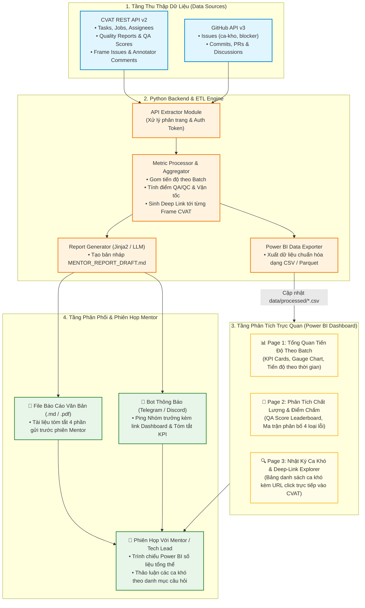

# 🏛️ Kiến Trúc Mô Hình Hybrid: Python ETL & Power BI Analytics Dashboard

Tài liệu này đặc tả chi tiết kiến trúc **Mô hình Lai (Hybrid Architecture)** kết hợp sức mạnh xử lý dữ liệu và tự động hóa của **Python Backend** với năng lực phân tích trực quan hóa cấp doanh nghiệp của **Power BI Dashboard**, đồng thời vẫn đảm bảo khả năng sinh báo cáo văn bản tự động trước các phiên Mentor.

---

## 1. Tại Sao Lựa Chọn Mô Hình Hybrid?

Trong các dự án thị giác máy tính quy mô lớn, việc chỉ dùng đơn lẻ Power BI hoặc chỉ dùng web code thuần (Streamlit / React) thường bộc lộ những hạn chế cố hữu:

| Tiêu Chí | Power BI Độc Lập | Custom Web Độc Lập (Streamlit) | **Mô Hình Hybrid (Python + Power BI)** |
| :--- | :--- | :--- | :--- |
| **Xử lý API & Authentication** | ⚠️ Rất khó (Power Query hạn chế Bearer Token & phân trang động) | ✅ Dễ dàng bằng Python | 🏆 **Tối ưu**: Python gánh toàn bộ ETL và API auth phức tạp |
| **Trực quan hóa & Drill-down** | 🏆 Cực mạnh, chuẩn Business Intelligence | ⚠️ Hạn chế hơn, tốn nhiều công code UI | 🏆 **Tối ưu**: Tận dụng Power BI kéo thả trực quan, drill-down theo annotator/batch |
| **Soạn thảo báo cáo văn bản** | ❌ Yếu (Power BI không tối ưu cho văn bản, Q&A markdown) | ✅ Dễ format | 🏆 **Tối ưu**: Python sinh file `MENTOR_REPORT_DRAFT.md` chuẩn chỉnh |
| **Lên lịch & Bắn thông báo** | ⚠️ Cần license Power BI Pro/Premium | ✅ Dễ dàng cấu hình | 🏆 **Tối ưu**: GitHub Actions / Python chạy cron hoàn toàn miễn phí |

---

## 2. Sơ Đồ Kiến Trúc Mô Hình Hybrid (Hybrid Data Flow)

### Mã nguồn Mermaid:

---

## 3. Hợp Đồng Dữ Liệu Xuất Cho Power BI (Data Schema Contracts)

Python ETL Engine chịu trách nhiệm chuẩn hóa dữ liệu thô từ CVAT & GitHub thành 3 bảng dữ liệu quan hệ (Relational Tables) lưu trữ tại `data/processed/`:

### 📄 Bảng 1: `batch_progress.csv` (Tiến độ theo Batch)
| Tên Cột | Kiểu Dữ Liệu | Ví Dụ | Ý Nghĩa Nghiệp Vụ |
| :--- | :--- | :--- | :--- |
| `batch_id` | String | `Batch-01` | Mã định danh lô dữ liệu gán nhãn |
| `task_id` | Integer | `217` | Mã Task trên CVAT |
| `total_frames` | Integer | `1200` | Tổng số lượng frame của batch |
| `completed_frames` | Integer | `1050` | Số frame đã hoàn tất kiểm định |
| `validation_frames` | Integer | `100` | Số frame đang chờ Reviewer duyệt |
| `annotation_frames` | Integer | `50` | Số frame đang được gán nhãn dở |
| `progress_pct` | Float | `87.5` | Phần trăm hoàn thành (%) |
| `avg_velocity_fps` | Float | `2.4` | Vận tốc gán nhãn trung bình (frames/phút) |
| `est_completion_date` | Date | `2026-10-12` | Ngày dự kiến hoàn tất toàn bộ batch |

### 📄 Bảng 2: `qa_metrics.csv` (Điểm chất lượng & Phân bố lỗi)
| Tên Cột | Kiểu Dữ Liệu | Ví Dụ | Ý Nghĩa Nghiệp Vụ |
| :--- | :--- | :--- | :--- |
| `annotator` | String | `NguyenVanA` | Tên thành viên gán nhãn |
| `batch_id` | String | `Batch-01` | Mã batch tương ứng |
| `total_reviewed` | Integer | `250` | Số frame đã qua kiểm định QA |
| `passed_frames` | Integer | `235` | Số frame đạt chuẩn ngay lần đầu |
| `qa_score` | Float | `94.0` | Điểm chất lượng trung bình (thang 100) |
| `err_box_displacement`| Integer | `8` | Số lỗi viền bounding box bị lệch/lỏng |
| `err_wrong_class` | Integer | `4` | Số lỗi gán nhầm nhãn đối tượng |
| `err_missing_object` | Integer | `2` | Số lỗi bỏ sót vật thể |
| `err_attribute` | Integer | `1` | Số lỗi sai thuộc tính phụ |

### 📄 Bảng 3: `edge_cases.csv` (Danh sách ca khó & Deep-Link CVAT)
| Tên Cột | Kiểu Dữ Liệu | Ví Dụ | Ý Nghĩa Nghiệp Vụ |
| :--- | :--- | :--- | :--- |
| `case_id` | String | `EC-042` | Mã định danh ca khó |
| `job_id` | Integer | `104` | Mã Job trên CVAT |
| `frame_idx` | Integer | `45` | Số thứ tự frame hình |
| `severity` | String | `Blocker` | Mức độ nghiêm trọng (`Blocker`, `Major`, `Minor`) |
| `annotator` | String | `NguyenVanA` | Người gắn cờ hoặc đặt câu hỏi |
| `current_class` | String | `dang_sac` | Nhãn hiện tại đang phân vân |
| `candidate_class`| String | `do_chiem_cho` | Nhãn đối ứng khả dĩ |
| `annotator_question`| String | `Cáp sạc vắt qua nóc xe có tính là đang sạc không?` | Câu hỏi chi tiết gửi Mentor |
| `cvat_deep_link` | String (URL) | `https://cvat.example.org/tasks/217/jobs/104?frame=45` | **Deep Link chuyển thẳng tới frame** |
| `status` | String | `Open` | Trạng thái (`Open`, `Mentor_Resolved`, `Closed`) |

---

## 4. Thiết Kế 3 Trang Trực Quan Trong Power BI

### 🖥️ Trang 1: Tổng Quan Tiến Độ Theo Batch (Batch Progress Overview)
* **KPI Cards phía trên**: Tổng số Frame, % Hoàn thành toàn dự án, Vận tốc trung bình cả nhóm, Số ngày còn lại đến hạn nộp.
* **Biểu đồ Cột Chồng (Stacked Bar Chart)**: Tiến độ phân rã theo từng Batch (`Completed` vs `Validation` vs `In Progress`).
* **Slicer (Bộ lọc)**: Lọc động theo `Batch ID`, `Thành viên gán nhãn`, `Khoảng ngày`.

### 🖥️ Trang 2: Phân Tích Chất Lượng & Điểm Chấm (Quality & QA Scoring)
* **Bảng Xếp Hạng (Leaderboard)**: Bảng xếp hạng thành viên theo `Điểm QA/QC` và `Tỷ lệ Pass/Reject`.
* **Biểu đồ Donut / Treemap**: Phân bố 4 loại lỗi phổ biến nhất (`Lệch Bounding Box`, `Sai Nhãn`, `Bỏ Sót Nhãn`, `Sai Thuộc Tính`).
* **Biểu đồ Phân Tán (Scatter Plot)**: Tương quan giữa *Vận tốc gán nhãn* và *Điểm QA* (giúp phát hiện ai gán ẩu hoặc ai gán quá chậm).

### 🖥️ Trang 3: Danh Mục Ca Khó & Deep-Link (Edge-Case Action Board)
* **Bảng Chi Tiết Ca Khó (Table Visual)**:
  * Hiển thị danh sách các ca khó được xếp theo mức độ ưu tiên (`Blocker` màu đỏ, `Major` màu vàng, `Minor` màu xanh).
  * Cột **"Link CVAT"** được cấu hình dạng `Web URL` $\rightarrow$ Nhóm trưởng và Mentor chỉ cần **click 1 lần là mở ngay giao diện gán nhãn CVAT trên trình duyệt**.
* **Thẻ Tóm Tắt Câu Hỏi (Text Card)**: Khi click chọn 1 dòng ca khó trong bảng, thẻ câu hỏi bên cạnh sẽ hiển thị nguyên văn thắc mắc của annotator.

---

## 5. Cơ Chế Làm Mới Dữ Liệu Tự Động (Refresh Strategy)

1. **Scheduled Sync (Theo Lịch)**:
   * GitHub Actions định kỳ chạy pipeline $\rightarrow$ xuất đè các file CSV mới nhất vào thư mục `data/processed/` $\rightarrow$ đẩy lên repository GitHub.
2. **Power BI Data Refresh**:
   * **Cách 1 (Desktop)**: Nhóm trưởng mở file `report_dashboard.pbix`, bấm nút **"Refresh"** (hoặc `F5`), Power BI tự nạp dữ liệu CSV mới nhất chỉ trong 5 giây.
   * **Cách 2 (Power BI Service - Tự động 100%)**: Lưu trữ file CSV trên OneDrive / SharePoint đồng bộ với repo, Power BI Service tự động refresh theo lịch hẹn mà không cần mở ứng dụng.
