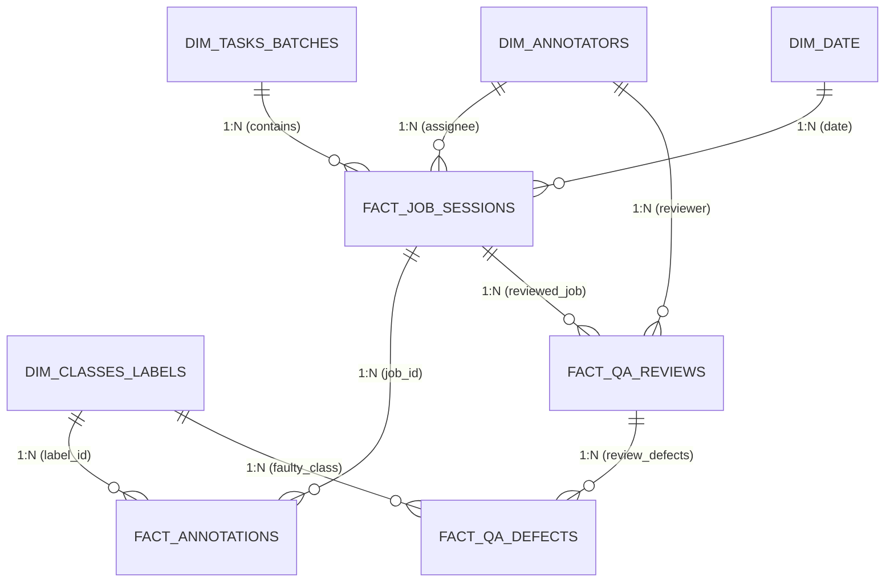

# 📊 ĐẶC TẢ DỮ LIỆU & BỘ CHỈ SỐ BÁO CÁO (ANALYTICS & DATA SPECIFICATION)

> **Tài liệu Kỹ thuật Dự án**: Hệ thống Tự động hóa Phân tích Tiến độ & Quản trị Chất lượng Gán nhãn Dữ liệu (CVAT - GitHub - Power BI).  
> **Tác giả & Phê duyệt**: Đinh Công Minh (Project Lead)  
> **Phiên bản**: v1.0.0

---

## 📌 1. MIND MAP — PHÂN TÍCH TOÀN CẢNH NGHIỆP VỤ

Sơ đồ phân rã toàn diện 4 trụ cột nghiệp vụ quản trị gán nhãn dữ liệu Computer Vision:

```mermaid
mindmap
  root((Quản Trị Vận Hành Gán Nhãn CVAT))
    1. Tiến Độ & Vận Tốc
      Sản Lượng
        Tổng Frames hoàn thành
        Tổng Objects tạo mới
        Sản lượng trung bình theo ca/ngày
      Vận Tốc & Thời Gian
        Tốc độ gán cá nhân: Frames/giờ & Objects/giờ
        Thời gian xử lý trung bình: AHT per Frame & per Object
        Phân tách Active Time vs Idle Time
      Tiến Độ Lô: % Hoàn thành & Dự báo ngày xong Batch
    2. Chất Lượng & QA-QC
      So Sánh Ground Truth: Có Benchmark
        Intersection over Union: IoU Box & Mask
        Chỉ số AI: Precision, Recall, F1-Score
        Ma trận nhầm lẫn: Confusion Matrix theo Class
      Đánh Giá Qua Reviewer: Chưa Có GT
        Số lần trả về: Rejection Count & Rework Rate
        Tỷ lệ đạt lần đầu: First-Time Pass Rate - FTPR
        Mật độ lỗi: Defect Density per 100 frames
      Phân Loại Lỗi Bug
        Lệch bounding box: Box displacement
        Sai nhãn: Wrong class
        Bỏ sót đối tượng: Missing object
        Sai thuộc tính: Wrong attributes
    3. Hình Học & Phân Bổ Dữ Liệu
      Phân Bổ Class
        Tần suất xuất hiện từng nhãn
        Tỷ lệ mất cân bằng dữ liệu: Imbalance Ratio
      Hình Học Vật Thể: Bbox & Polygon
        Diện tích trung bình: pixels & % diện tích frame
        Phân loại kích thước COCO: Small, Medium, Large
        Chu vi & Độ phức tạp đa giác: Polygon vertices
    4. Phân Khúc & Ra Quyết Định Nhân Sự
      Rủi ro: Gán ẩu, Tốc độ cao nhưng Rework cao -> Đình chỉ, rà soát 100%
      Đào tạo: Chậm và Sai nhiều -> Re-training Guideline
      Tối ưu: Làm rất chuẩn nhưng thao tác chậm -> Hướng dẫn phím tắt/công cụ AI
      Khen thưởng: Ngôi sao (Tốc độ cao + Chất lượng cao) -> Thăng cấp Reviewer
```

---

## 🏗️ 2. DATA MODEL — MÔ HÌNH DỮ LIỆU POWER BI (STAR SCHEMA)

Hệ thống sử dụng mô hình hình sao (Star Schema) để tối ưu hóa bộ nhớ VertiPaq và tốc độ truy vấn DAX trên Power BI:



---

## 📚 3. DATA DICTIONARY — TỪ ĐIỂN DỮ LIỆU HỆ THỐNG

| STT | Bảng Dữ Liệu | Loại Bảng | Tên Cột | Mô Tả Nghiệp Vụ | Kiểu Dữ Liệu | Nguồn Trích Xuất / API |
| :---: | :--- | :--- | :--- | :--- | :--- | :--- |
| **1** | `dim_annotators` | Dimension | `annotator_id` | Mã định danh người gán nhãn | Text (PK) | CVAT User ID |
| | | | `full_name` | Họ tên thành viên | Text | CVAT First/Last Name |
| | | | `role` | Vai trò trong dự án (`Annotator`, `Reviewer`, `Core`) | Text | Phân quyền nhóm |
| | | | `joined_date` | Ngày bắt đầu tham gia dự án | Date | Quản lý thâm niên |
| **2** | `dim_tasks_batches` | Dimension | `batch_id` | Mã định danh lô dữ liệu | Text (PK) | Mã đợt (VD: `Batch-01`) |
| | | | `task_id` | Mã Task trên CVAT | Integer | `GET /api/tasks` |
| | | | `task_name` | Tên Task gán nhãn | Text | Tên hiển thị trên CVAT |
| | | | `target_deadline` | Hạn chót hoàn thành batch | Date | Deadline bàn giao |
| **3** | `dim_classes_labels`| Dimension | `label_id` | Mã định danh nhãn | Integer (PK) | CVAT Label ID |
| | | | `label_name` | Tên nhãn đối tượng (`car`, `pedestrian`,...) | Text | Tên class |
| | | | `label_category` | Nhóm danh mục (`Vehicle`, `Human`, `Obstacle`) | Text | Phân nhóm class |
| | | | `color_hex` | Mã màu hiển thị | Text | HEX Color CVAT |
| **4** | `dim_date` | Dimension | `date_key` | Khóa ngày giao dịch | Date (PK) | Bảng lịch Calendar chuẩn |
| | | | `day_name` / `week` / `month` / `quarter` / `year` | Các cấp độ thời gian | Text / Int | Dùng để cắt lát thời gian |
| **5** | `fact_job_sessions` | Fact | `job_id` | Mã định danh Job trên CVAT | Integer (PK) | `GET /api/jobs` |
| | | | `task_id` | Mã Task liên kết | Integer (FK) | Liên kết `dim_tasks_batches` |
| | | | `annotator_id` | Người thực hiện | Text (FK) | Liên kết `dim_annotators` |
| | | | `date_key` | Ngày nộp job | Date (FK) | Liên kết `dim_date` |
| | | | `total_frames` | Tổng số frame trong Job | Integer | Thường từ 50 - 200 frames |
| | | | `total_objects` | Tổng số đối tượng đã vẽ | Integer | Đếm tổng box/polygon |
| | | | `active_time_hours` | Thời gian thao tác thực tế (trừ idle) | Decimal | CVAT Analytics Event Log |
| | | | `status` | Trạng thái Job (`annotation`, `validation`, `completed`) | Text | CVAT Stage |
| **6** | `fact_annotations` | Fact | `annotation_id` | Mã duy nhất của đối tượng | Text (PK) | CVAT Shape ID |
| | | | `job_id` | Thuộc Job nào | Integer (FK) | Liên kết `fact_job_sessions` |
| | | | `frame_idx` | Số thứ tự frame trong Job | Integer | 0-indexed frame |
| | | | `label_id` | Nhãn đối tượng | Integer (FK) | Liên kết `dim_classes_labels` |
| | | | `shape_type` | Loại hình vẽ (`rectangle`, `polygon`, `points`) | Text | Hình học đối tượng |
| | | | `bbox_width` | Chiều rộng hộp viền (pixel) | Decimal | $x_2 - x_1$ |
| | | | `bbox_height` | Chiều cao hộp viền (pixel) | Decimal | $y_2 - y_1$ |
| | | | `area_pixels` | Diện tích vùng gán nhãn ($px^2$) | Decimal | $w \times h$ hoặc Shoelace polygon |
| | | | `frame_area_pct` | Tỷ lệ diện tích so với ảnh (%) | Decimal | $(\text{area} / (W \times H)) \times 100\%$ |
| | | | `size_scale` | Phân loại cỡ vật thể COCO (`Small`, `Medium`, `Large`) | Text | Ngưỡng 1024 và 9216 px² |
| **7** | `fact_qa_reviews` | Fact | `review_id` | Mã lượt review | Text (PK) | Sinh mã tự động |
| | | | `job_id` | Job được thẩm định | Integer (FK) | Liên kết `fact_job_sessions` |
| | | | `reviewer_id` | Người chấm | Text (FK) | Liên kết `dim_annotators` |
| | | | `review_iteration` | Lần chấm thứ mấy (1, 2, 3...) | Integer | Lần đầu là 1, sửa lại là 2 |
| | | | `review_decision` | Kết quả duyệt (`Accepted`, `Rejected`) | Text | Quyết định duyệt |
| | | | `reviewed_at` | Thời điểm kiểm định | DateTime | Timestamp review |
| **8** | `fact_qa_defects` | Fact | `defect_id` | Mã lỗi ghi nhận | Text (PK) | `GET /api/issues` |
| | | | `review_id` | Thuộc đợt review nào | Text (FK) | Liên kết `fact_qa_reviews` |
| | | | `frame_idx` | Frame phát hiện lỗi | Integer | Vị trí frame bị lỗi |
| | | | `label_id` | Nhãn bị lỗi | Integer (FK) | Liên kết `dim_classes_labels` |
| | | | `defect_type` | Loại lỗi (`box_displacement`, `wrong_class`, `missing_object`, `wrong_attr`) | Text | 4 loại lỗi chuẩn hóa |
| | | | `severity` | Mức độ nghiêm trọng (`Blocker`, `Major`, `Minor`) | Text | Phân cấp độ lỗi |
| | | | `cvat_deep_link` | Đường dẫn mở trực tiếp frame lỗi | Text (URL) | `https://cvat.../jobs/{job}?frame={f}` |
| **9** | `fact_ground_truth_eval` | Fact | `eval_id` | Mã kết quả chấm tự động qua GT | Text (PK) | `GET /api/quality/reports` |
| | | | `job_id` | Job được đối chiếu | Integer (FK) | Job đối chiếu |
| | | | `mean_iou` | Điểm Intersection over Union trung bình | Decimal | Thang 0.0 -> 1.0 |
| | | | `precision` | Độ chính xác Precision | Decimal | $TP / (TP + FP)$ |
| | | | `recall` | Độ bao phủ Recall | Decimal | $TP / (TP + FN)$ |
| | | | `f1_score` | Điểm điều hòa F1 | Decimal | $(2 \cdot P \cdot R) / (P + R)$ |

---

## 🎯 4. LOGIC PHÂN KHÚC & BỘ QUY TẮC PHÂN LOẠI (SEGMENTATION LOGIC)

### 4.1. Phân khúc Vận tốc & Sản lượng (Velocity Segment)
```sql
CASE
    WHEN a.avg_frames_per_hour >= 60 THEN N'Vận tốc siêu nhanh'
    WHEN a.avg_frames_per_hour >= 40 THEN N'Vận tốc đạt chuẩn'
    WHEN a.avg_frames_per_hour >= 20 THEN N'Vận tốc trung bình'
    ELSE N'Vận tốc chậm / Cần hỗ trợ'
END AS velocity_segment
```

### 4.2. Phân khúc Chất lượng & Rủi ro (Quality & Risk Segment)
```sql
CASE
    -- Điều kiện rủi ro cao: Bị trả về nhiều hoặc FTPR quá thấp hoặc điểm GT kém
    WHEN a.first_time_pass_rate < 0.80 
      OR a.rejection_rate >= 0.20 
      OR ISNULL(a.mean_f1_score, 1.0) < 0.85
        THEN N'Rủi ro chất lượng cao'
    ELSE N'Chất lượng đạt chuẩn'
END AS quality_risk_flag
```

### 4.3. Phân loại Kích thước & Độ khó vật thể (COCO Scale Segment)
```sql
CASE
    WHEN obj.area_pixels < 1024 THEN N'Vật thể nhỏ (Small < 32x32)'
    WHEN obj.area_pixels BETWEEN 1024 AND 9216 THEN N'Vật thể vừa (Medium 32-96)'
    ELSE N'Vật thể lớn (Large > 96x96)'
END AS object_size_segment
```

### 4.4. Ma trận Phân khúc Toàn diện Cuối cùng (Final Annotator Segmentation)

| Nhóm Ưu Tiên | Phân Khúc Hành Động | Điều Kiện Logic (SQL / DAX) | Giải Thích Nghiệp Vụ | Mục Tiêu & Hành Động Can Thiệp |
| :---: | :--- | :--- | :--- | :--- |
| **1** | **Nguy cơ gán ẩu (Fast & Faulty)** | `velocity_segment = N'Vận tốc siêu nhanh'`<br/>`AND quality_risk_flag = N'Rủi ro chất lượng cao'` | Làm cực nhanh nhưng tỷ lệ sai hỏng cao, bị Reviewer trả về liên tục. | **Đình chỉ giao batch mới**, yêu cầu dừng lại tự sửa lỗi và rà soát lại 100% các job đã nộp. |
| **2** | **Cần đào tạo lại (Low Skill / Bottleneck)** | `velocity_segment = N'Vận tốc chậm / Cần hỗ trợ'`<br/>`AND quality_risk_flag = N'Rủi ro chất lượng cao'` | Tốc độ chậm và chất lượng vẫn kém $\rightarrow$ chưa nắm rõ Annotation Guideline. | **Gửi đào tạo lại (Re-training)** 1-on-1 với Mentor/QA Lead, chỉ giao các task đơn giản. |
| **3** | **Cầu toàn quá mức (Slow but Steady)** | `velocity_segment = N'Vận tốc chậm / Cần hỗ trợ'`<br/>`AND quality_risk_flag = N'Chất lượng đạt chuẩn'` | Chất lượng rất tốt (FTPR > 95%), nhưng tốn quá nhiều thời gian căn chỉnh từng pixel. | **Tối ưu thao tác**: Hướng dẫn dùng phím tắt CVAT, hỗ trợ bằng AI Pre-annotation để đẩy tốc độ. |
| **4** | **Nhân sự nòng cốt (Star Annotator)** | `velocity_segment IN (N'Vận tốc siêu nhanh', N'Vận tốc đạt chuẩn')`<br/>`AND quality_risk_flag = N'Chất lượng đạt chuẩn'` | Vừa nhanh vừa chuẩn, ít khi bị trả về. | **Khen thưởng & Thăng cấp**: Giao các lô ca khó (edge cases) hoặc đào tạo làm Reviewer. |
| **5** | **Nhân sự mới đang làm quen (Onboarding)** | `a.tenure_days <= 14`<br/>`AND a.total_jobs_completed <= 10` | Mới tham gia dự án dưới 2 tuần, sản lượng chưa ổn định. | **Theo dõi sát sao**: Review 100% sản phẩm trong 10 job đầu tiên. |
| **6** | **Ngủ đông / Không hoạt động (Inactive)** | `a.active_hours_7d = 0` | Không phát sinh thao tác gán nhãn trong 7 ngày gần nhất. | **Thu hồi tài khoản/Job** để tái phân bổ cho thành viên khác tránh nghẽn tiến độ. |
| **7** | **Nhân sự nền tảng (Core Performer)** | *Các trường hợp còn lại* | Đạt mức trung bình của dự án về cả tốc độ lẫn tỷ lệ pass. | **Duy trì tiến độ chuẩn**, giao việc theo kế hoạch định kỳ. |

---

## 🧮 5. BỘ MEASURES & CÔNG THỨC TÍNH TOÁN (DAX)

| STT | Tên Chỉ Tiêu | Tên Measure (DAX) | Ý Nghĩa / Định Nghĩa | Công Thức DAX Chuẩn |
| :---: | :--- | :--- | :--- | :--- |
| **1** | **Tổng frames hoàn thành** | `Total_Completed_Frames` | Tổng số frame đã hoàn tất khâu kiểm định | `Total_Completed_Frames = CALCULATE(SUM(fact_job_sessions[total_frames]), fact_job_sessions[status] = "completed")` |
| **2** | **Tổng objects tạo mới** | `Total_Objects_Created` | Tổng số đối tượng (boxes, polygons) đã gán | `Total_Objects_Created = COUNTROWS(fact_annotations)` |
| **3** | **Tổng giờ làm việc thực** | `Total_Active_Hours` | Tổng thời gian thao tác thực tế | `Total_Active_Hours = SUM(fact_job_sessions[active_time_hours])` |
| **4** | **Tốc độ gán (Frames/giờ)** | `Velocity_Frames_Per_Hour` | Vận tốc gán nhãn theo frame trên 1 giờ làm việc | `Velocity_Frames_Per_Hour = DIVIDE([Total_Completed_Frames], [Total_Active_Hours], 0)` |
| **5** | **Tốc độ gán (Objects/giờ)** | `Velocity_Objects_Per_Hour` | Vận tốc gán nhãn theo số lượng vật thể/giờ | `Velocity_Objects_Per_Hour = DIVIDE([Total_Objects_Created], [Total_Active_Hours], 0)` |
| **6** | **Thời gian trung bình/frame** | `Avg_Time_Per_Frame_Mins` | Số phút trung bình để hoàn tất 1 khung hình | `Avg_Time_Per_Frame_Mins = DIVIDE([Total_Active_Hours] * 60, [Total_Completed_Frames], 0)` |
| **7** | **Thời gian trung bình/object**| `Avg_Time_Per_Object_Secs` | Số giây trung bình để vẽ xong 1 đối tượng | `Avg_Time_Per_Object_Secs = DIVIDE([Total_Active_Hours] * 3600, [Total_Objects_Created], 0)` |
| **8** | **Tỷ lệ đạt lần đầu (FTPR)** | `First_Time_Pass_Rate` | Tỷ lệ job được duyệt ngay vòng review đầu tiên | `First_Time_Pass_Rate = DIVIDE(CALCULATE(COUNTROWS(fact_qa_reviews), fact_qa_reviews[review_iteration] = 1, fact_qa_reviews[review_decision] = "Accepted"), CALCULATE(COUNTROWS(fact_qa_reviews), fact_qa_reviews[review_iteration] = 1), 0)` |
| **9** | **Tỷ lệ trả về (Rework Rate)**| `Rejection_Rate` | Tỷ lệ các lượt review bị đánh rớt (Reject) | `Rejection_Rate = DIVIDE(CALCULATE(COUNTROWS(fact_qa_reviews), fact_qa_reviews[review_decision] = "Rejected"), COUNTROWS(fact_qa_reviews), 0)` |
| **10** | **Tổng số lỗi ghi nhận** | `Total_Defects` | Tổng số lỗi bug do Reviewer phát hiện | `Total_Defects = COUNTROWS(fact_qa_defects)` |
| **11** | **Mật độ bug/100 frames** | `Defect_Density_Per_100F` | Tần suất lỗi trên 100 khung hình | `Defect_Density_Per_100F = DIVIDE([Total_Defects] * 100, [Total_Completed_Frames], 0)` |
| **12** | **Số bug trung bình/job** | `Avg_Defects_Per_Job` | Trung bình số bug phát hiện trên mỗi job | `Avg_Defects_Per_Job = DIVIDE([Total_Defects], DISTINCTCOUNT(fact_qa_reviews[job_id]), 0)` |
| **13** | **Điểm mIoU trung bình (GT)** | `Avg_mIoU_Score` | Chỉ số IoU trung bình khi so với Ground Truth | `Avg_mIoU_Score = AVERAGE(fact_ground_truth_eval[mean_iou])` |
| **14** | **Điểm F1 trung bình (GT)** | `Avg_F1_Score` | Điểm F1-Score trung bình khi so với Ground Truth | `Avg_F1_Score = AVERAGE(fact_ground_truth_eval[f1_score])` |
| **15** | **Diện tích vật thể TB ($px^2$)**| `Avg_Object_Area_Pixels` | Diện tích pixel trung bình của nhãn | `Avg_Object_Area_Pixels = AVERAGE(fact_annotations[area_pixels])` |
| **16** | **Tỷ lệ diện tích TB (%)** | `Avg_Area_Frame_Pct` | Tỷ lệ chiếm dụng khung hình trung bình | `Avg_Area_Frame_Pct = AVERAGE(fact_annotations[frame_area_pct])` |
| **17** | **Tỷ lệ vật thể nhỏ (Small %)**| `Pct_Small_Objects` | Tỷ lệ vật thể nhỏ (<1024 px²) gây khó khăn | `Pct_Small_Objects = DIVIDE(CALCULATE(COUNTROWS(fact_annotations), fact_annotations[size_scale] = "Small"), [Total_Objects_Created], 0)` |
| **18** | **Số lượng nhân sự rủi ro** | `Count_At_Risk_Annotators` | Số thành viên bị xếp vào nhóm chất lượng xấu | `Count_At_Risk_Annotators = CALCULATE(DISTINCTCOUNT(fact_job_sessions[annotator_id]), FILTER(dim_annotators, [Rejection_Rate] >= 0.20))` |
| **19** | **Vận tốc TB toàn hệ thống** | `System_Avg_Velocity` | Điểm chuẩn (Benchmark) tốc độ toàn dự án | `System_Avg_Velocity = CALCULATE([Velocity_Frames_Per_Hour], ALL(dim_annotators))` |
| **20** | **Tỷ lệ tiến độ dự án** | `Project_Progress_Pct` | % Hoàn thành so với tổng số frame cần gán | `Project_Progress_Pct = DIVIDE([Total_Completed_Frames], SUM(dim_tasks_batches[total_frames_target]), 0)` |

---

## 🖥️ 6. ĐẶC TẢ CHI TIẾT 5 TRANG BÁO CÁO POWER BI

| STT | Trang Báo Cáo | Mục Tiêu Phân Tích | Nội Dung & Visual Hiển Thị | Tương Tác & Tính Năng Nâng Cao |
| :---: | :--- | :--- | :--- | :--- |
| **1** | **Project Executive 360** | Cung cấp góc nhìn toàn cảnh về tiến độ hoàn thành các Batch, dự báo ngày hoàn thành và năng suất chung. | • **KPI Cards**: Tổng Frames Hoàn Thành, % Tiến Độ Dự Án, Vận Tốc Toàn Đội (frames/h), Tỷ Lệ Đạt Lần Đầu (FTPR).<br/>• **Gauge Chart**: % Hoàn thành so với mục tiêu Milestone.<br/>• **Stacked Bar Chart**: Tiến độ theo từng Batch (`Completed` vs `Validation` vs `In Progress`).<br/>• **Line Chart**: Xu hướng sản lượng hoàn thành theo ngày kèm đường trung bình động 7 ngày (7-day MA). | • **Slicer**: Lọc theo Batch ID, Task ID, Khoảng thời gian.<br/>• **Drill-through**: Bấm vào 1 cột Batch để chuyển sang xem chi tiết chất lượng của Batch đó ở Trang 2. |
| **2** | **QA & Quality Deep-Dive** | Đánh giá độ tin cậy của dữ liệu; phân tích ma trận lỗi của Reviewer và độ khớp với Ground Truth. | • **KPI Cards**: Tỷ Lệ Trả Về (Rework Rate), First-Time Pass Rate (FTPR), Mật Độ Bug/100 Frame, Điểm mIoU / F1 TB.<br/>• **Donut Chart**: Tỷ trọng 4 nhóm lỗi (`Lệch Box`, `Sai Class`, `Sót Vật Thể`, `Sai Thuộc Tính`).<br/>• **100% Stacked Bar**: Cơ cấu loại lỗi phát sinh theo từng Class đối tượng.<br/>• **Scatter Plot**: Điểm IoU vs Thời gian gán nhãn trên từng Job (phát hiện job làm ẩu vs job cẩn thận).<br/>• **Matrix Table**: Bảng chi tiết kết quả Review (Số lần kiểm tra, Số lần reject, Danh sách lỗi chính). | • **Bookmark Tabs**: Chuyển đổi giữa chế độ xem *"Chấm bằng Reviewer"* và *"So sánh Ground Truth"*.<br/>• **Tooltips**: Hover vào loại lỗi để xem ví dụ mô tả cụ thể từ Reviewer. |
| **3** | **Annotator Performance & Matrix** | Đánh giá hiệu suất cá nhân, xếp hạng thành viên và phân loại nhân sự theo Ma Trận Hành Động. | • **KPI Cards**: Tổng số nhân sự Active, Vận tốc trung bình, Nhân sự đạt chuẩn, Nhân sự cần cảnh báo.<br/>• **Scatter Plot 4 Góc Phần Tư (Matrix 2x2)**:<br/>  - Trục X: Vận tốc (Frames/giờ)<br/>  - Trục Y: Chất lượng (% FTPR)<br/>  - Thể hiện 4 nhóm: *Ngôi sao, Gán ẩu, Cầu toàn, Cần đào tạo*.<br/>• **Leaderboard Table**: Xếp hạng thành viên theo Final Segment, Vận tốc, Tỷ lệ lỗi, Số giờ làm việc.<br/>• **Bullet Chart**: Vận tốc cá nhân so với mốc chuẩn (Benchmark) toàn đội. | • **Slicer**: Phân loại theo Final Segment (`Nguy cơ gán ẩu`, `Cần đào tạo lại`, `Nhân sự nòng cốt`,...).<br/>• **Drill-down**: Nhấp vào 1 nhân sự để xem lịch sử nộp bài của từng job qua các ngày. |
| **4** | **Label Geometry & Data Distribution** | Khám phá đặc tính hình học của tập dataset; đánh giá mức độ mất cân bằng nhãn và độ khó của ảnh. | • **KPI Cards**: Tổng số Objects, Diện tích trung bình ($px^2$), Tỷ lệ chiếm frame (%), % Vật thể nhỏ (Small).<br/>• **Treemap / Bar Chart**: Phân bổ số lượng instance theo từng Label Class (phát hiện Class Imbalance).<br/>• **Histogram / Boxplot**: Phân bố diện tích Bounding Box/Polygon theo từng Class.<br/>• **Clustered Bar Chart**: Tỷ lệ phân bố kích thước theo chuẩn COCO (`Small` vs `Medium` vs `Large`) theo từng Batch. | • **Filter**: Lọc theo Class để xem kích thước trung bình và độ lệch chuẩn của riêng class đó.<br/>• **Insight Callout**: Cảnh báo các Batch có tỷ lệ vật thể nhỏ $>60\%$ (giải thích nguyên nhân vận tốc bị sụt giảm). |
| **5** | **Edge-Case Explorer & Deep-Link** | Cung cấp danh sách các khung hình gây tranh cãi, lỗi nghiêm trọng cần Mentor/Leader gỡ vướng trước phiên họp. | • **KPI Cards**: Tổng số Ca Khó Đang Mở (Open Issues), Số ca Blocker, Số ca đã giải quyết (Resolved).<br/>• **Action Table**: Bảng danh sách ca khó gồm: `Case ID`, `Annotator`, `Frame Index`, `Severity`, `Mô Tả Câu Hỏi`, và cột **"Deep Link CVAT"**.<br/>• **Text Card (Preview)**: Hiển thị trọn vẹn câu hỏi và đề xuất nhãn của Annotator khi chọn 1 dòng trong bảng. | • **Interactive URL Link**: Cột URL được cấu hình kiểu Web URL, **Leader/Mentor click 1 lần là trình duyệt tự mở đúng frame trên giao diện CVAT**.<br/>• **Status Filter**: Lọc theo `Blocker`, `Major`, `Minor`. |
