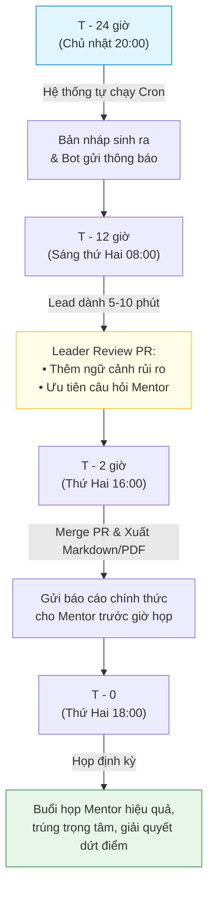

# ⚙️ Hướng Dẫn Triển Khai & Vận Hành (Deployment & Workflow)

Tài liệu này cung cấp hướng dẫn từng bước để thiết lập và vận hành hệ thống báo cáo tự động, bao gồm cấu hình Secrets, tích hợp Webhook và chu trình làm việc hàng tuần.

---

## 1. Cấu hình GitHub Secrets

Khi chạy tự động hóa trên GitHub Actions, truy cập:
`Repository Settings` $\rightarrow$ `Secrets and variables` $\rightarrow$ `Actions` $\rightarrow$ `New repository secret` và thêm các biến sau:

| Secret Name | Mô tả | Ví dụ |
| :--- | :--- | :--- |
| `CVAT_HOST` | Địa chỉ máy chủ CVAT | `https://cvat.example.org` |
| `CVAT_TOKEN` | Token cá nhân truy cập CVAT | `d8a9e...` |
| `DEFAULT_TASK_ID` | Task ID mặc định cần lấy báo cáo | `217` |
| `TELEGRAM_BOT_TOKEN` | Token Telegram Bot gửi thông báo | `712345678:AAH...` |
| `TELEGRAM_CHAT_ID` | ID phòng chat của Nhóm trưởng / Nhóm | `-1001234567890` |

---

## 2. Thiết lập Webhook Thông Báo (Telegram & Discord)

### 2.1. Telegram Bot (Khuyên dùng)
1. Chat với `@BotFather` trên Telegram để tạo bot mới bằng lệnh `/newbot`.
2. Sao chép API Token nhận được vào biến `TELEGRAM_BOT_TOKEN`.
3. Thêm bot vào nhóm làm việc của team và lấy `chat_id` qua `@userinfobot`.
4. Khi chạy xong, bot sẽ gửi tin nhắn tóm tắt với định dạng:
   ```text
   🚀 [BÁO CÁO TỰ ĐỘNG SẴN SÀNG]
   📊 Task ID: 217 | Tiến độ: 81.6% (2,080 / 2,550 frames)
   ⚠️ Ca khó cần xem: 3 frames
   ❓ Câu hỏi mở: 2 issues
   👉 Xem chi tiết bản nháp tại PR: #15
   ```

### 2.2. Discord Webhook
1. Truy cập cài đặt kênh Discord: `Edit Channel` $\rightarrow$ `Integrations` $\rightarrow$ `Webhooks` $\rightarrow$ `New Webhook`.
2. Sao chép URL Webhook vào biến `DISCORD_WEBHOOK_URL`.

---

## 3. Quy trình vận hành định kỳ của Nhóm trưởng (Team Lead Workflow)



* **T-24h**: Hệ thống tự động kích hoạt vào tối Chủ Nhật, cào toàn bộ số liệu và tạo PR bản thảo.
* **T-12h**: Nhóm trưởng nhận thông báo trên điện thoại qua Telegram, vào review PR trong 5 phút.
* **T-2h**: Chốt báo cáo và gửi link cho Mentor để Mentor kịp đọc trước khi vào họp.
* **T-0**: Phiên họp diễn ra ngắn gọn, giải quyết đúng các ca khó có sẵn Deep Link và câu hỏi mở đã chuẩn bị.
