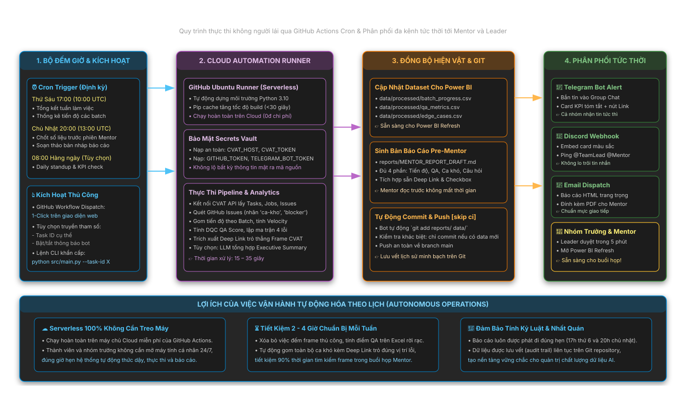
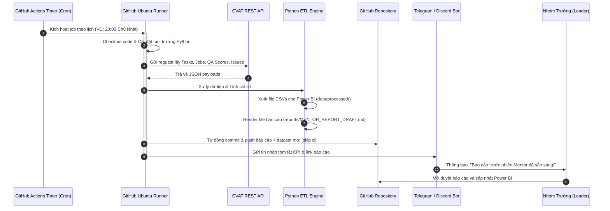

# ⏰ Hướng Dẫn Vận Hành Luồng Tự Động Hóa Theo Lịch (Scheduled Workflow Guide)

Tài liệu này hướng dẫn cách cấu hình, vận hành và quản lý luồng tự động hóa chạy theo lịch (**Scheduled Automation**) của hệ thống Auto Annotation Report Pipeline.

---

## 1. Cơ Chế Hoạt Động Của Scheduled Pipeline

Hệ thống hỗ trợ 2 phương thức kích hoạt theo lịch định kỳ:

1. **Cloud-Native Automation (GitHub Actions Cron)**: Chạy hoàn toàn tự động trên hạ tầng máy chủ của GitHub, không đòi hỏi máy tính cá nhân phải mở 24/7.
2. **Local Fallback Scheduler (Python Cron / Windows Task Scheduler)**: Dự phòng khi môi trường thử nghiệm CVAT chỉ chạy trong mạng nội bộ (mạng LAN/VPN) mà GitHub bên ngoài không thể truy cập.



---


## 2. Cấu Hình Lịch Chạy Định Kỳ (GitHub Actions Cron)

Workflow mẫu được lưu trữ tại [`workflows/scheduled_report.yml`](../workflows/scheduled_report.yml) (hoặc triển khai tại `.github/workflows/scheduled_report.yml` khi tài khoản đã cấp quyền `workflow`).


### Bảng Quy Đổi Giờ Chạy (UTC vs Giờ Việt Nam - ICT / UTC+7)

| Giờ Việt Nam (ICT, UTC+7) | Cú Pháp Cron (Giờ chuẩn UTC) | Mục Đích Nghiệp Vụ |
| :--- | :--- | :--- |
| **17:00 Thứ Sáu** | `0 10 * * 5` | Tổng kết tiến độ tuần làm việc; chuẩn bị số liệu cuối tuần cho nhóm |
| **20:00 Chủ Nhật** | `0 13 * * 0` | Chốt số liệu toàn diện trước phiên Mentor đầu tuần; tự động gửi bản thảo cho Leader |
| **08:00 Hàng Ngày** *(Tùy chọn)* | `0 1 * * *` | Báo cáo tiến độ đầu ngày (Daily Standup) |



---

## 3. Cấu Hình Bí Mật (Repository Secrets & Variables)

Để GitHub Actions kết nối an toàn với máy chủ CVAT và các kênh thông báo, Nhóm trưởng cần thiết lập các Secret trong:
👉 **GitHub Repo $\rightarrow$ Settings $\rightarrow$ Secrets and variables $\rightarrow$ Actions**:

| Tên Secret | Bắt Buộc? | Mô Tả & Ví Dụ |
| :--- | :---: | :--- |
| `CVAT_HOST` | **Có** | Địa chỉ máy chủ CVAT (VD: `https://cvat.myorg.com` hoặc `https://app.cvat.ai`) |
| `CVAT_TOKEN` | **Có** | Personal Access Token lấy từ trang cá nhân CVAT |
| `CVAT_TASK_ID` | **Có** | ID của Task chính cần trích xuất báo cáo (VD: `217`) |
| `TELEGRAM_BOT_TOKEN` | Tùy chọn | Token của Telegram Bot tạo từ `@BotFather` |
| `TELEGRAM_CHAT_ID` | Tùy chọn | Chat ID hoặc Group ID nhận tin nhắn báo cáo |
| `DISCORD_WEBHOOK_URL`| Tùy chọn | URL Webhook của kênh Discord nhóm |
| `GEMINI_API_KEY` | Tùy chọn | API Key của Google Gemini để tự động tóm tắt nhận xét |

---

## 4. Kích Hoạt Thủ Công Khi Cần Báo Cáo Gấp (Manual Trigger)

Khi Leader hoặc Mentor cần số liệu đột xuất ngoài khung giờ định kỳ:

1. Truy cập vào tab **Actions** trên GitHub repository.
2. Chọn workflow **"Scheduled Pre-Mentor Report & Power BI Sync"** ở danh sách bên trái.
3. Bấm nút **"Run workflow"** ở góc phải:
   * Có thể tùy biến điền `task_id` khác nếu muốn quét task phụ.
   * Tick chọn hoặc bỏ chọn gửi thông báo Telegram/Discord.
4. Bấm **"Run workflow"** màu xanh để chạy ngay lập tức (thường mất 30–60 giây).

---

## 5. Phương Án Dự Phòng: Chạy Định Kỳ Cục Bộ (Local Scheduler)

Trong trường hợp máy chủ CVAT chỉ truy cập được trong mạng nội bộ máy tính (`localhost:8080`), bạn có thể kích hoạt bộ lên lịch bằng Python:

### Chạy bằng script Python nền (`scheduler.py`):
```python
import schedule
import time
import subprocess
import logging

def job():
    logging.info("Khởi chạy pipeline định kỳ...")
    subprocess.run(["python", "src/main.py", "--export-powerbi"])

# Thiết lập chạy vào 17:00 chiều thứ 6 và 20:00 tối chủ nhật
schedule.every().friday.at("17:00").do(job)
schedule.every().sunday.at("20:00").do(job)

logging.info("Trình lên lịch cục bộ đã khởi động. Đang lắng nghe...")
while True:
    schedule.run_pending()
    time.sleep(60)
```
