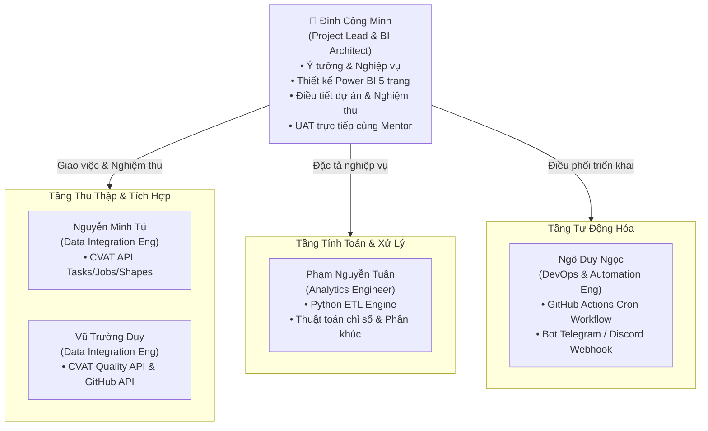

# 📑 KẾ HOẠCH QUẢN LÝ DỰ ÁN & PHÂN CHIA NHIỆM VỤ (PROJECT MANAGEMENT PLAN)

> **Dự án**: Auto Annotation Report Pipeline (CVAT & GitHub Sync - Power BI Hybrid)  
> **Người lập & Trưởng dự án (Project Lead)**: Đinh Công Minh  
> **Phiên bản**: v1.0.0  
> **Ngày phê duyệt**: 08/10/2026

---

## 👥 1. CƠ CẤU ĐỘI NGŨ & MA TRẬN PHÂN VAI (TEAM STRUCTURE & ROLES)

Dự án được tổ chức và điều phối bởi **Đinh Công Minh (Lead)** cùng 4 kỹ sư chuyên trách:

### Bảng phân định trách nhiệm chi tiết:

| Thành Viên | Vai Trò Chính | Trách Nhiệm Cốt Lõi |
| :--- | :--- | :--- |
| **Đinh Công Minh** | **Project Lead & BI Architect** | • Định hướng bài toán, làm rõ yêu cầu nghiệp vụ và cấu trúc báo cáo. • Xây dựng và chuẩn hóa tài liệu kỹ thuật & quản lý dự án. • Thiết kế trực quan Dashboard Power BI (5 trang báo cáo chuẩn doanh nghiệp). • Kiểm tra chéo, đánh giá chất lượng và nghiệm thu kết quả của các thành viên. • Trực tiếp làm việc, thuyết trình, chạy kiểm thử UAT cùng Mentor/Leader. |
| **Nguyễn Minh Tú** | **Data Integration Engineer (CVAT)** | • Phụ trách kết nối **CVAT REST API v2** trích xuất Tasks, Jobs, Assignees, Annotations (Shapes/Boxes/Polygons). • Xử lý xác thực Token (PAT), phân trang và xuất dữ liệu thô (Raw JSON). |
| **Vũ Trường Duy** | **Data Integration Engineer (Quality & GitHub)** | • Phụ trách kết nối **CVAT Quality Reports API** (mIoU, conflicts) và **Issues API**. • Tích hợp **GitHub API** trích xuất danh sách ca khó (label `ca-kho`, `blocker`), PRs, Commits. • Tạo sinh Deep Link chuẩn xác trỏ trực tiếp đến từng frame lỗi trên CVAT. |
| **Phạm Nguyễn Tuân** | **Analytics & ETL Engineer** | • Xây dựng module Python ETL Engine làm sạch dữ liệu và tổng hợp thành mô hình Star Schema. • Cài đặt bộ công thức tính toán chỉ số: Vận tốc (Frames/h, Objects/h), AHT, FTPR, Rework, Defect Density, Diện tích Shoelace, COCO Scale. • Hiện thực hóa thuật toán phân khúc thành viên (Final Annotator Segmentation). • Xuất các file dữ liệu chuẩn hóa dạng CSV/Parquet vào thư mục `data/processed/`. |
| **Ngô Duy Ngọc** | **DevOps & Automation Engineer** | • Xây dựng luồng tự động hóa CI/CD qua **GitHub Actions** (`scheduled_report.yml`). • Thiết lập lịch chạy định kỳ (Cron Trigger) tự kích hoạt ETL trước các phiên họp. • Tự động hóa khâu sinh file báo cáo văn bản (`MENTOR_REPORT_DRAFT.md`) qua Template Engine. • Tích hợp Bot gửi thông báo tự động (Telegram / Discord Webhook) gửi link dashboard tới nhóm. |

---

## 🎯 2. MA TRẬN TRÁCH NHIỆM RACI (RACI MATRIX)

* **R (Responsible)**: Người trực tiếp thực hiện công việc.
* **A (Accountable)**: Người chịu trách nhiệm cuối cùng và có quyền nghiệm thu (Lead Đinh Công Minh).
* **C (Consulted)**: Người được tham vấn ý kiến chuyên môn.
* **I (Informed)**: Người được thông báo khi công việc hoàn thành.

| Giai Đoạn & Hạng Mục Công Việc | Đinh Công Minh (Lead) | Nguyễn Minh Tú | Vũ Trường Duy | Phạm Nguyễn Tuân | Ngô Duy Ngọc |
| :--- | :---: | :---: | :---: | :---: | :---: |
| **1. Khảo sát nghiệp vụ & Xây dựng Data Dictionary** | **A / R** | C | C | C | I |
| **2. Kết nối & Trích xuất CVAT Tasks / Jobs API** | **A** | **R** | C | I | I |
| **3. Kết nối CVAT Quality API & GitHub Issues API** | **A** | C | **R** | I | I |
| **4. Viết script ETL & Tính toán Bộ chỉ số (Velocity, QA, Area)** | **A** | I | I | **R** | C |
| **5. Cài đặt Logic Phân khúc thành viên (Segmentation)** | **A** | I | I | **R** | I |
| **6. Xây dựng Data Model & Thiết kế 5 trang Power BI** | **A / R** | I | I | C | I |
| **7. Viết GitHub Actions Cron Workflow tự động** | **A** | I | I | C | **R** |
| **8. Tích hợp Bot thông báo Telegram / Discord** | **A** | I | I | I | **R** |
| **9. Kiểm thử nội bộ (Dry Run) & Nghiệm thu kết quả** | **A / R** | R | R | R | R |
| **10. Chạy UAT & Báo cáo trực tiếp cùng Mentor** | **A / R** | I | I | I | I |

---

## 📋 3. BẢNG PHÂN RÃ CÔNG VIỆC CHI TIẾT (WBS & DELIVERABLES)

| STT | Giai Đoạn | Đầu Mục Nhiệm Vụ | PIC | Hỗ Trợ | Sản Phẩm Bàn Giao | Tiêu Chí Nghiệm Thu (Lead Minh Duyệt) |
| :---: | :--- | :--- | :---: | :---: | :--- | :--- |
| **I** | **TUẦN 1: NGHIỆP VỤ & KẾT NỐI API** | | | | | |
| 1.1 | Kiến trúc & Nghiệp vụ | Hoàn thiện tài liệu Data Dictionary, Data Model, Logic chỉ số | **Minh** | Nhóm | `PROJECT_ANALYTICS_SPEC.md` | Tài liệu rõ ràng, 100% thành viên hiểu đúng định nghĩa. |
| 1.2 | Data Integration | Module trích xuất CVAT Tasks, Jobs, Assignees, Annotations | **Tú** | Duy | `src/extractors/cvat_extractor.py` | Vượt qua phân trang, lấy đủ 100% dữ liệu không lỗi token. |
| 1.3 | Data Integration | Module trích xuất CVAT Quality Reports & GitHub Issues | **Duy** | Tú | `src/extractors/github_extractor.py` | Lấy đúng điểm QA, frame issues và sinh đúng Deep Link CVAT. |
| 1.4 | Setup Môi trường | Khởi tạo cấu trúc repository, file `.env.example`, `requirements.txt` | **Ngọc** | Tuân | Khung Repo chuẩn hóa | Chạy `pip install` thành công, bảo mật thông tin secrets. |
| **II** | **TUẦN 2: ETL & TÍNH TOÁN CHỈ SỐ** | | | | | |
| 2.1 | Analytics Engine | Viết hàm tính Vận tốc (Frames/h, Objects/h) & AHT | **Tuân** | Minh | `src/processors/velocity.py` | Tính chính xác, lọc bỏ được thời gian idle (treo máy). |
| 2.2 | Analytics Engine | Viết hàm tính Chất lượng (FTPR %, Rework %, Defect Density) | **Tuân** | Duy | `src/processors/quality.py` | Đếm chuẩn số lần trả về, phân loại đúng 4 nhóm lỗi. |
| 2.3 | Analytics Engine | Viết thuật toán diện tích Shoelace & Phân loại COCO Scale | **Tuân** | Tú | `src/processors/geometry.py` | Tính chuẩn diện tích đa giác, phân loại Small/Medium/Large. |
| 2.4 | Segmentation | Cài đặt thuật toán phân khúc thành viên (Final Annotator Segment) | **Tuân** | Minh | `src/processors/segmentation.py` | Khớp 100% điều kiện logic phân loại nhân sự đã thống nhất. |
| 2.5 | Data Export | Xuất dữ liệu sạch dạng 4 file CSV vào `data/processed/` | **Tuân** | Ngọc | Bộ 4 file CSV chuẩn hóa | Không lỗi font UTF-8, không sót giá trị NULL bất thường. |
| **III**| **TUẦN 3: BÁO CÁO POWER BI & TỰ ĐỘNG HÓA** | | | | | |
| 3.1 | Power BI Modeling | Nạp dữ liệu, thiết lập Star Schema và tạo Calendar Table | **Minh** | Tuân | `report_dashboard.pbix` (Model) | Quan hệ 1:N hoạt động trơn tru, không có vòng lặp quan hệ. |
| 3.2 | DAX Development | Viết và kiểm thử bộ 20 công thức DAX Measures | **Minh** | Tuân | Bộ DAX Measures | Số liệu DAX khớp 100% với kết quả script Python của Tuân. |
| 3.3 | UI/UX Dashboard | Thiết kế trực quan 5 Trang Báo Cáo trên Power BI | **Minh** | Nhóm | Hoàn thiện 5 trang Visual | Giao diện đẹp, Deep Link click 1 phát mở đúng frame CVAT. |
| 3.4 | CI/CD Workflow | Thiết lập GitHub Actions Workflow tự động (`scheduled_report.yml`)| **Ngọc** | Tú, Duy | File cron chạy định kỳ | Pipeline tự kích hoạt, tự kéo data và push CSV mới lên repo. |
| 3.5 | Notification Bot | Xây dựng Bot Telegram/Discord tự động ping báo cáo & link PBI | **Ngọc** | Minh | Module `src/notifiers/bot.py` | Bắn tin nhắn tóm tắt KPI chuẩn format vào nhóm trước buổi họp. |
| **IV** | **TUẦN 4: KIỂM THỬ NỘI BỘ, UAT MENTOR & BÀN GIAO** | | | | | |
| 4.1 | Nghiệm thu nội bộ | Chạy kiểm thử toàn trình (End-to-End Dry Run) 2 vòng độc lập | **Minh** | Nhóm | Báo cáo Dry-Run & Fixlist | Luồng chạy trơn tru từ Trigger đến Dashboard không lỗi phát sinh. |
| 4.2 | UAT cùng Mentor | Thuyết trình, trình chiếu Power BI và chạy kiểm thử UAT | **Minh** | Nhóm | Biên bản nghiệm thu UAT | Mentor duyệt nghiệm thu, đánh giá cao giá trị ứng dụng thực tế. |
| 4.3 | Đóng gói & Bàn giao | Hoàn thiện tài liệu bàn giao, README hướng dẫn vận hành | **Minh** | Ngọc, Tuân | Toàn bộ tài liệu v1.0.0 | Tài liệu đầy đủ, chuyển giao dễ dàng cho người mới vận hành. |

---

## 🔄 4. NGUYÊN TẮC PHỐI HỢP & BÀN GIAO KỸ THUẬT (DATA CONTRACT & GIT FLOW)

1. **Hợp đồng dữ liệu (Data Contract)**:
   * **Tú & Duy** cam kết xuất dữ liệu JSON thô theo schema thống nhất vào thư mục `data/raw/`.
   * **Tuân** cam kết xuất đúng tên cột, kiểu dữ liệu vào `data/processed/*.csv`. Bất kỳ thay đổi nào về tên cột phải được **Đinh Công Minh** chấp thuận trước để tránh làm gãy visual trên Power BI.
2. **Quy tắc Quản lý Nhánh Git (Branching Strategy)**:
   * `main`: Nhánh chạy chính thức, chỉ merge khi có sự phê duyệt của Lead.
   * `feature/api-cvat-github`: Nhánh làm việc của **Tú** và **Duy**.
   * `feature/metrics-etl`: Nhánh làm việc của **Tuân**.
   * `feature/automation-actions`: Nhánh làm việc của **Ngọc**.
   * Mọi Pull Request (PR) phải được **Đinh Công Minh** review và merge.
3. **Cơ chế Họp & Báo cáo Tiến độ (Daily Standup)**:
   * Họp nhanh 15 phút hoặc cập nhật ngắn gọn cuối ngày qua nhóm chat:
     1. *Hôm nay đã hoàn thành hạng mục nào?*
     2. *Ngày mai sẽ làm gì?*
     3. *Có blocker/khó khăn nào cần Minh hoặc Mentor tháo gỡ không?*
