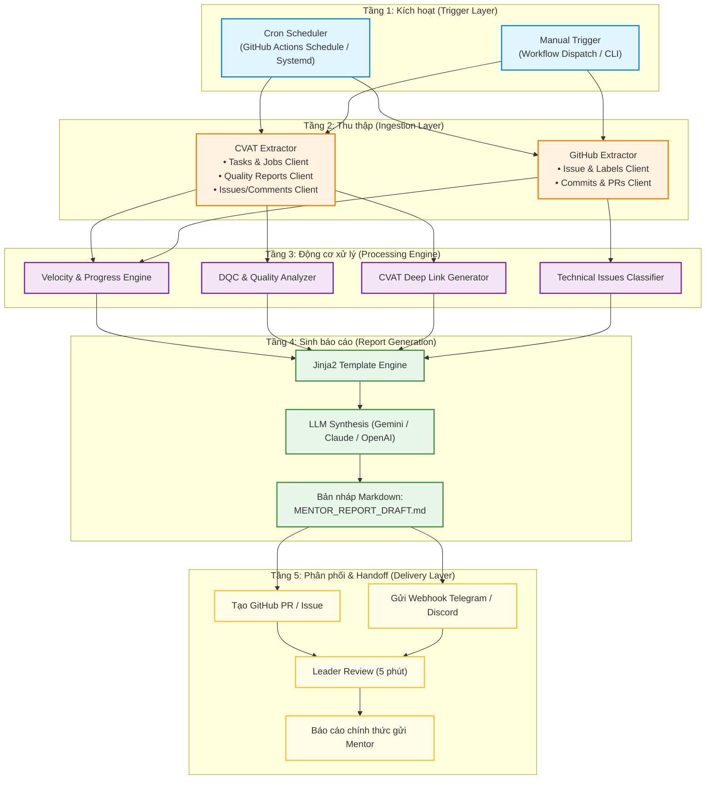
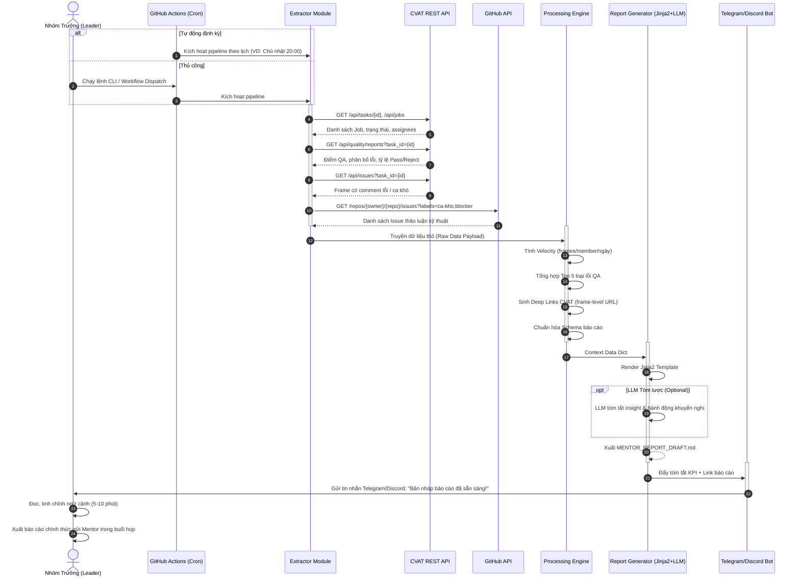

# 🏗️ Kiến Trúc Hệ Thống: Auto Annotation Report Pipeline

Tài liệu này đặc tả chi tiết kiến trúc kỹ thuật, luồng dữ liệu (Data Pipeline), mô hình dữ liệu và các thành phần cốt lõi của hệ sinh thái tự động hóa báo cáo CVAT & GitHub.

---

## 1. Tổng quan kiến trúc (Architecture Overview)

Hệ thống được thiết kế theo kiến trúc **Event-Driven & Pipeline Architecture** (Kiến trúc đường ống hướng sự kiện). Mục tiêu là biến đổi dữ liệu thô, phân tán từ các hệ thống quản trị gán nhãn thành báo cáo nghiệp vụ có tính hành động cao (Actionable Insights).

---

## 2. Trình tự thực thi (Sequence Diagram)

Sơ đồ trình tự biểu diễn sự tương tác giữa các thành phần từ khi kích hoạt đến khi giao bản báo cáo hoàn chỉnh cho Leader:

---

## 3. Các module thành phần cốt lõi

### 3.1. Extractor Layer (`src/extractors/`)
* **`CVATExtractor`**:
  * Sử dụng thư viện `requests` hoặc `cvat-sdk` chính thức.
  * Hỗ trợ xác thực qua Token Header (`Authorization: Token <key>`) hoặc Basic Auth.
  * Cơ chế tự động phân trang (Pagination handling) khi danh sách Jobs hoặc Issues vượt quá 100 items.
* **`GitHubExtractor`**:
  * Sử dụng GitHub REST API v3 và Octokit/PyGithub.
  * Lọc issues theo bộ nhãn quy ước: `ca-kho`, `mentor-question`, `blocker`.
  * Trích xuất các PR liên quan đến data tool hoặc annotation guideline changes.

### 3.2. Processing Engine Layer (`src/processors/`)
* **`VelocityCalculator`**:
  $$\text{Velocity} = \frac{\text{Số frames đã chuyển sang completed trong kỳ}}{\text{Số annotators tham gia} \times \text{Số ngày}}$$
  $$\text{Progress Rate (\%)} = \frac{\sum \text{Frames Completed}}{\text{Tổng số frames của Task}} \times 100\%$$
* **`QAMetricsAnalyzer`**:
  * Đọc Quality Report từ CVAT: trích xuất độ lệch IoU trung bình, lỗi sai label, lỗi vẽ box thiếu hoặc thừa.
  * Phân loại lỗi theo mức độ nghiêm trọng: `CRITICAL` (ảnh hưởng trực tiếp đến ground-truth), `WARNING` (sai sót nhỏ về bounding box padding).
* **`DeepLinkBuilder`**:
  * Xây dựng URL trực tiếp đến frame cụ thể:
    $$\text{URL} = \texttt{\{CVAT\_HOST\}/tasks/\{task\_id\}/jobs/\{job\_id\}?frame=\{frame\_number\}}$$

### 3.3. Generator Layer (`src/generators/`)
* Sử dụng thư viện **Jinja2** để ánh xạ số liệu vào khung Markdown chuẩn hóa.
* Hỗ trợ cắm module LLM (`Gemini Flash / OpenAI GPT-4o-mini`) với prompt tối ưu để:
  * Viết phần tóm tắt điều hành (Executive Summary) 3 câu.
  * Đề xuất 3 câu hỏi sắc bén nhất cho Leader hỏi Mentor.

### 3.4. Notifier Layer (`src/notifiers/`)
* Gửi payload tóm tắt dạng Rich Text tới:
  * **Telegram Bot API**: Tin nhắn Markdown kèm inline button trỏ đến file Draft.
  * **Discord Webhook**: Embed message màu sắc trực quan (Xanh nếu đạt KPI, Đỏ nếu trễ hạn hoặc QA thấp).

---

## 4. An toàn dữ liệu & Quản lý Token (Security)

1. **Tuân thủ Bảo vệ Dữ liệu**:
   * Hệ thống chỉ trích xuất metadata số lượng, điểm số, ID của job/frame và nội dung ghi chú kỹ thuật.
   * Không lưu trữ hoặc tải về hình ảnh thô có chứa thông tin nhận dạng cá nhân (PII như mặt người, biển số xe) lên máy chủ báo cáo.
2. **Quản trị Bí mật (Secrets Management)**:
   * Mọi Token (`CVAT_TOKEN`, `GITHUB_TOKEN`, `TELEGRAM_BOT_TOKEN`) tuyệt đối không hardcode trong mã nguồn.
   * Chỉ được nạp thông qua biến môi trường (`.env` trên local hoặc `GitHub Secrets` trên CI/CD).
