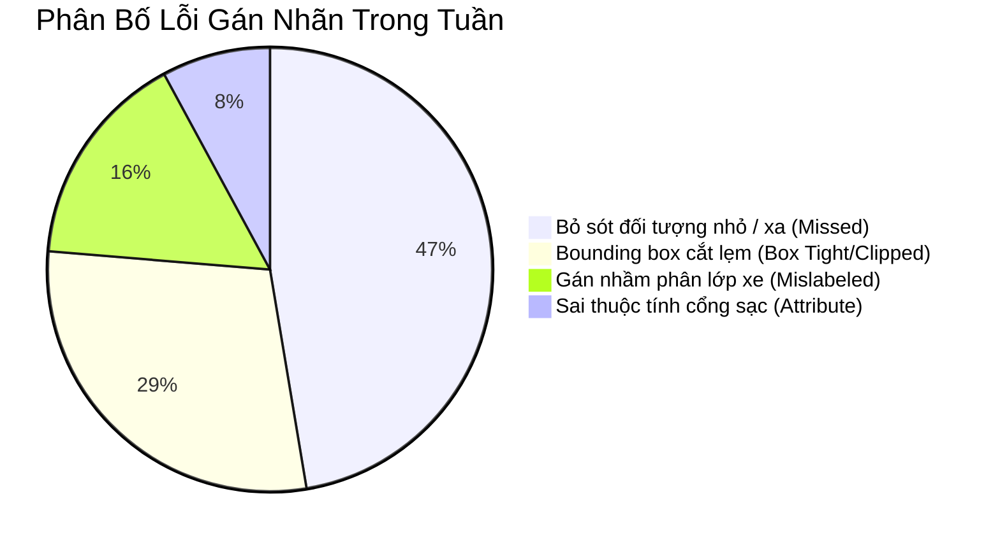

# 📝 BÁO CÁO TIẾN ĐỘ & CHẤT LƯỢNG GÁN NHÃN (BẢN MẪU THỰC TẾ)
> **Dự án**: Giám sát thị giác trạm sạc xe điện & Nhận diện phương tiện  
> **Kỳ báo cáo**: Tuần 03 (Từ 01/10/2026 đến 07/10/2026)  
> **Thời gian sinh tự động**: 2026-10-07 20:00:15 (UTC+7)  
> **Trạng thái**: *Bản nháp tự động — Đã qua Review của Nhóm trưởng*

---

## 1. TIẾN ĐỘ BATCH & KPI (BATCH PROGRESS & VELOCITY)

* **Task ID**: `217` (`batch_chargestation_oct_week1`)
* **Tổng số khung hình**: `2,550 frames` (11 Jobs)
* **Số khung hình đã hoàn thành**: `2,080 / 2,550 frames` (**81.6%**)
* **Vận tốc trung bình (Average Velocity)**: `36.7 frames/người/giờ` (Đạt 105% KPI mục tiêu)
* **Dự kiến hoàn thành (ETA)**: Ngày 09/10/2026 (Trước hạn chót Sprint 1 ngày)

### Bảng chi tiết phân bổ công việc theo nhân sự:

| Thành viên (Assignee) | Số Job | Frames xong | Tỷ lệ (%) | Vận tốc (f/h) | Trạng thái |
| :--- | :---: | :---: | :---: | :---: | :---: |
| Dinh Cong Minh (Lead) | 4 | 850 / 850 | 100% | 45.0 |  Hoàn thành |
| Nguyen Van A | 4 | 720 / 850 | 84.7% | 38.2 |  Đang gán |
| Tran Thi B | 3 | 510 / 850 | 60.0% | 27.5 | ⚠️ Chậm nhẹ (Gặp ca khó) |
| **Tổng thể đợt** | **11** | **2,080 / 2,550** | **81.6%** | **36.7** | **ĐẠT TIẾN ĐỘ** |

---

## 2. CHẤT LƯỢNG & ĐIỂM QA/QC (QUALITY CONTROL METRICS)

* **Tỷ lệ thẩm định đạt lần 1 (First-time Pass Rate)**: `88.5%` (Mục tiêu $\ge 85\%$).
* **Điểm QA trung bình toàn đợt**: `92.4 / 100`.
* **Tổng số lỗi do Reviewer ghi nhận**: `38 lỗi` trên tổng số 400 frames kiểm thử ngẫu nhiên (Audit sample 15%).

* **Nhận định chất lượng**:
  * Các lỗi tập trung chủ yếu ở việc **bỏ sót xe máy hoặc người đi bộ ở góc xa** của camera góc rộng (chiếm 47.4%). Nhóm trưởng đã nhắc nhở toàn đội kích hoạt chế độ zoom 400% khi rà soát góc ảnh.
  * Tỷ lệ sai nhãn phân lớp phương tiện đã giảm 50% so với tuần trước nhờ bổ sung tài liệu phân biệt giữa SUV cỡ nhỏ và Hatchback.

---

## 3. DANH SÁCH CA KHÓ KÈM DEEP LINK (EDGE CASES & DISPUTES)

Dưới đây là 3 ca khó gây tranh cãi lớn nhất trong tuần cần Mentor cho ý kiến chỉ đạo:

| STT | Frame ID | Vấn đề biên (Edge Case) | Tranh chấp & Đề xuất | CVAT Deep Link |
| :---: | :---: | :--- | :--- | :---: |
| 1 | **Frame #142** (Job 1719) | **Cáp sạc vắt ngang qua xe khác** Ô tô điện đỗ ở ô 1 nhưng kéo cáp từ trụ 2 sang để sạc; ô 2 có xe khác đỗ che | • **Ý kiến 1**: Gán xe ô 1 là `charging`, ô 2 là `blocked`. • **Ý kiến 2**: Gán cả hai xe là `charging_dispute`. 👉 *Nhóm đề xuất*: Áp dụng Ý kiến 1 theo nguyên tắc căn cứ đầu súng sạc. | [🔗 Mở Frame 142](https://cvat.transformerlabs.ai/tasks/217/jobs/1719?frame=142) |
| 2 | **Frame #205** (Job 1720) | **Xe tải giao hàng che khuất >70%** Xe tải đậu dừng trả hàng chắn camera, chỉ thấy 1 góc cản sau xe điện | • Hiện tại guideline chưa quy định ngưỡng che khuất tối đa. 👉 *Nhóm đề xuất*: Kích hoạt quy tắc `Abstain` (Bỏ qua không vẽ box) nếu vật thể bị che khuất quá 70% diện tích. | [🔗 Mở Frame 205](https://cvat.transformerlabs.ai/tasks/217/jobs/1720?frame=205) |
| 3 | **Frame #389** (Job 1722) | **Đèn pha xe đối diện gây lóa LED trụ sạc** Lóa sáng khiến đèn LED trụ sạc xanh dương bị ngả sang xanh lá | • Cần thống nhất quy tắc kiểm tra temporal: rà soát 3 frame trước và sau để xác định trạng thái thực. | [🔗 Mở Frame 389](https://cvat.transformerlabs.ai/tasks/217/jobs/1722?frame=389) |

---

## 4. CÂU HỎI MỞ & VẤN ĐỀ CẦN MENTOR GỠ RỐI (OPEN QUESTIONS)

### ❓ Câu hỏi 1: Quy chuẩn gán nhãn cho phương tiện 2 bánh dừng trong ô sạc ô tô
* **Ngữ cảnh**: Xuất hiện nhiều xe máy điện đỗ tạm trong ô sạc ô tô để trú mưa hoặc chờ người.
* **Vấn đề**: Taxonomy hiện tại chỉ có lớp `obstacle` (vật cản chung) và không có nhãn riêng cho xe 2 bánh vi phạm vị trí sạc.
* **Đề xuất từ nhóm**: Thêm thuộc tính `is_bay_blocking: true` cho lớp `two_wheeler` hoặc gán vào `obstacle`. Xin ý kiến Mentor về tác động tới mô hình downstream.
* 🔗 *Thảo luận chi tiết tại GitHub Issue*: [#42 - Taxonomy decision for two-wheelers in EV bays](https://github.com/nolanminhdinh/Auto-Annotation-Reporter/issues/42)

### ❓ Câu hỏi 2: Chiến lược chia Train/Val/Test chống Data Leakage
* **Ngữ cảnh**: Các đoạn video ghi hình liên tục trong 4 tiếng tại cùng 1 trạm sạc.
* **Vấn đề**: Nếu chia ngẫu nhiên từng frame sẽ bị rò rỉ bối cảnh ánh sáng và xe trùng lặp giữa tập Train và Test.
* **Đề xuất từ nhóm**: Nhóm đã quyết định chia theo **Group Key = `Station_ID + Date`** (35 trạm Train / 7 trạm Val / 8 trạm Test độc lập hoàn toàn). Xin Mentor phản biện tính chặt chẽ của phương án này.
* 🔗 *Thảo luận chi tiết tại GitHub Issue*: [#47 - Group Key Split Strategy](https://github.com/nolanminhdinh/Auto-Annotation-Reporter/issues/47)
