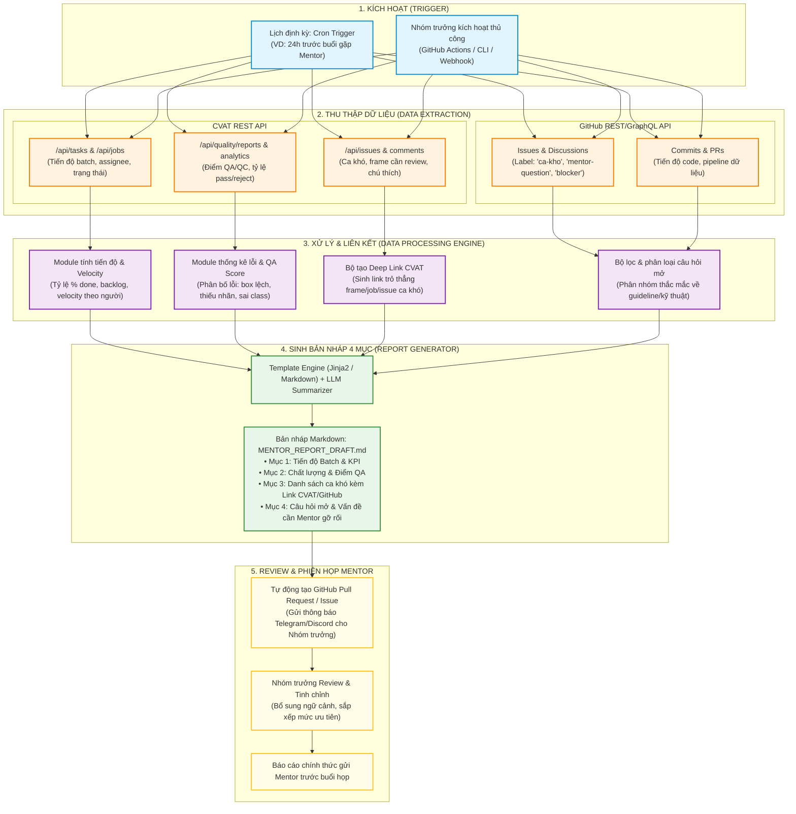
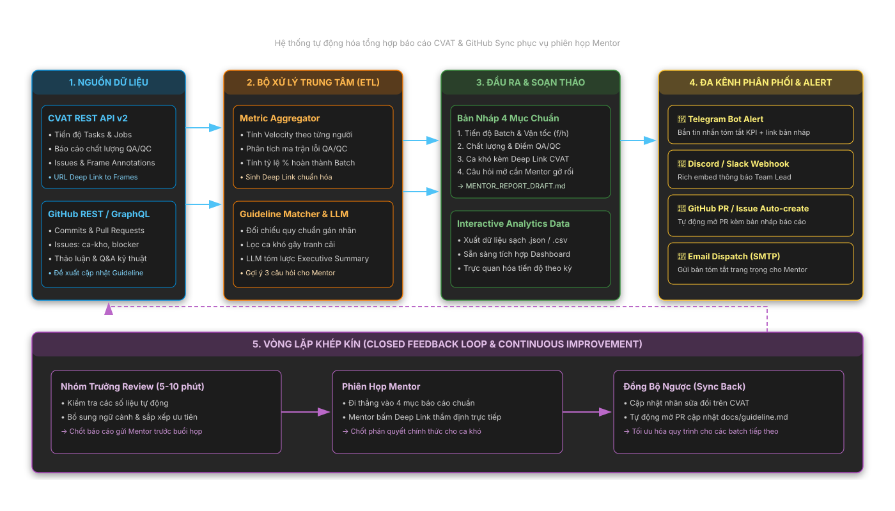
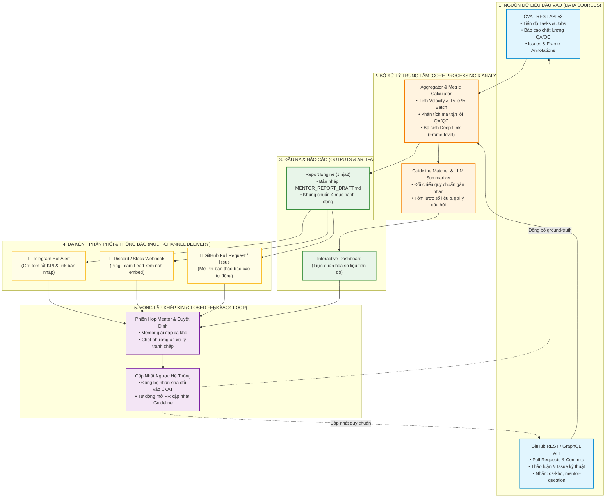

# 🔄 Tổng Hợp Biểu Đồ Workflow Dự Án (Project Workflows)

Tài liệu này tổng hợp **2 biểu đồ quy trình (Workflow Diagrams)** cốt lõi của hệ thống **Tự động hóa soạn báo cáo trước phiên Mentor (CVAT & GitHub Sync)**.

---

## 📊 Biểu Đồ 1: Quy Trình Pipeline 5 Giai Đoạn Khép Kín (5-Phase End-to-End Pipeline)

Biểu đồ này mô tả chi tiết đường ống dữ liệu từ thời điểm kích hoạt (Trigger), trích xuất API, tính toán chỉ số, sinh văn bản báo cáo cho tới bước Review của Nhóm trưởng.

### Mã nguồn Mermaid (Biểu đồ 1):

---

## 🔄 Biểu Đồ 2: Kiến Trúc Vòng Lặp Khép Kín & Điều Phối Đa Kênh (Closed-Loop Pipeline & Multi-Channel Delivery)

Biểu đồ này tập trung vào kiến trúc tổng thể của hệ thống, vòng lặp phản hồi (*closed feedback loop*) giữa quyết định của Mentor và việc cập nhật ngược lại nền tảng gán nhãn, cùng cơ chế thông báo đa kênh.

### Mã nguồn Mermaid (Biểu đồ 2):

---

## 🛡️ Cam Kết Bảo Mật & Toàn Vẹn Dữ Liệu

1. **Không chứa thông tin mật bên thứ ba**: Mọi dữ liệu mẫu, đường dẫn máy chủ và thông số định danh trong biểu đồ đều được chuẩn hóa theo chuẩn mở tổng quát (Generic Open Standards), không chứa token, bí mật doanh nghiệp, mã học viên hay thông tin nội bộ của bất kỳ tổ chức nào.
2. **Tuân thủ quy chuẩn bảo mật**: Quá trình trích xuất chỉ đọc metadata thống kê, không lưu giữ dữ liệu nhận dạng cá nhân (PII) trên đường ống báo cáo.
